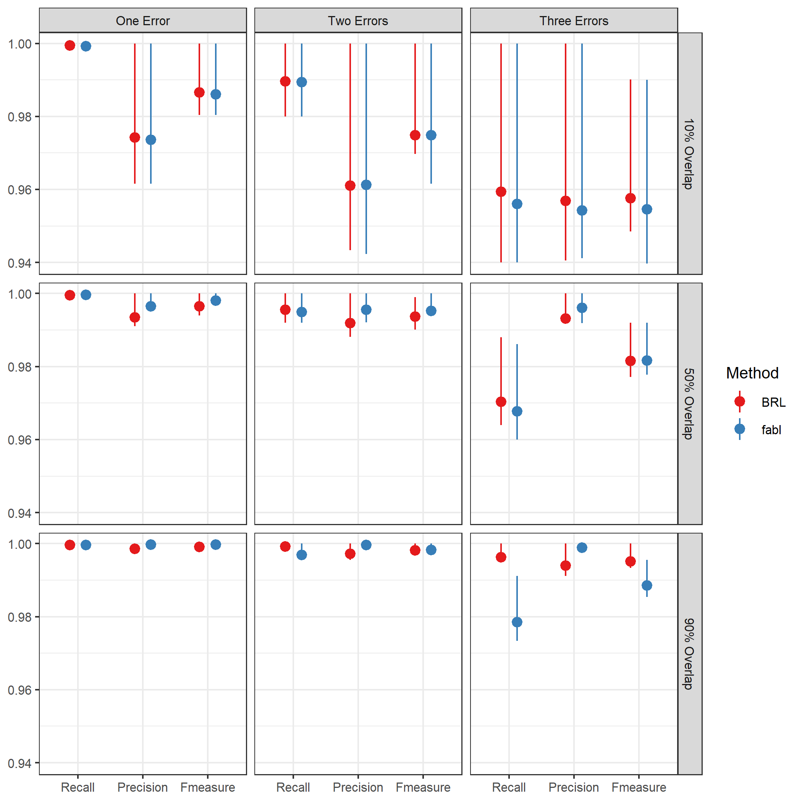
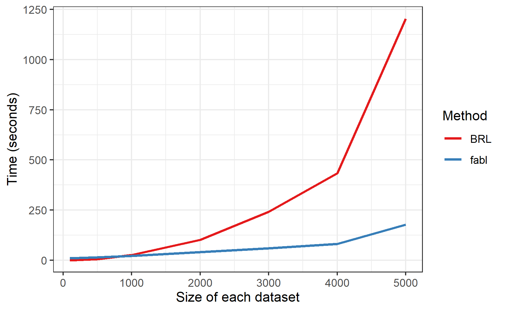

```{r setup, include=FALSE}
knitr::opts_chunk$set(echo=FALSE, out.height="80%", out.width="80%", fig.align = 'center')
```

# Introduction to Record Linkage

\begin{columns}
\begin{column}{0.5\textwidth}

\begin{itemize}
\item Record linkage is the task of identifying duplicate records over noisy datasets.

\item Easy with unique identifiers, difficult when faced with errors

\item Far ranging applications in business, public health, and human rights

\end{itemize}

\end{column}
\begin{column}{0.5\textwidth}  %%<--- here
    \begin{center}
     picture
     \end{center}
\end{column}
\end{columns}


# Fellegi and Sunter

```{r out.width="100%"}

```

# Notation

- File A with records indexed $i \in \{1, \ldots, n_A\}$ and file B with records $j \in \{1, \ldots, n_B\}$. We use $F$ features for linkage, with $L_f$ possible levels of agreement on feature $f$.

- $\Gamma \in \mathbb{R}^{n_A n_B \times F}$ matrix of comparison vectors where $\gamma_{ij}^f \in \{1, \ldots, L_f\}$

- $Z_j = \begin{cases} 
	i,  & \text{if records } i\in A \text{ and } j\in B \text{ match}; \\
	n_A + 1,  & \text{if record } j\in B \text{ has no match in } A; \\
	\end{cases}$

- $m_{fl} = P\left(\gamma_{ij}^f = l |Z_j = i\right)$

- $u_{fl} = P\left(\gamma_{ij}^f = l |Z_j \neq i\right)$

- $\lambda = P(Z_j \leq n_A)$

# m's and u's

# Previous work

- Fellegi and Sunter (1969)
  - independent classification of all $n_A n_B$ record pairs. Transitive closure acheived through postprocessing

- Enamorado et al (2019): \texttt{fastlink} 
  - provides efficient and scalable FS model

- Sadinle (2017) - Beta Record Linkage (\texttt{BRL}) 
  - Bayesian method for bipartite matching, strictly enforces one-to-one matching. Does not scale well to large linkage tasks

# Fast Beta Linkage (fabl)

$$P(\Gamma|\mathbf{Z}, \mathbf{m}, \mathbf{u}) = \prod_{j=1}^{n_B}  \prod_{i=1}^{n_A}\left[ \prod_{f=1}^{F}\prod_{l=1}^{L_f} m_{fl}^{I(Z_j = i)}u_{fl}^{I(Z_j \neq i)}\right]^{I(\gamma_{ij}^f = l)}$$

$$\mathbf{m_{f}} \sim \text{Dirichlet}(\alpha_{f1}, \ldots, \alpha_{fL_f})$$
$$\mathbf{u_{f}} \sim \text{Dirichlet}(\beta_{f1}, \ldots, \beta_{fL_f})$$
$$Z_j | \lambda =
\begin{cases} 
	\frac{1}{n_A}\lambda  & z_j \leq n_A; \\
	1-\lambda &  z_j  = n_A + 1 \\
\end{cases}$$
$$\lambda \sim \text{Beta}(\alpha_{\lambda}, \beta_{\lambda})$$

- Model specification allows for **parallel/distributed** computing, **hashing** of comparison vectors, and **storage efficient indexing (SEI)**

# Hashing

- Recognize there are at most $P = \prod_{f = 1}^F L_f$ unique agreement patterns, regardless of number of records. When $(i,j)$ pair exhibits agreement pattern $p$, say $(i, j) \in h_p$.

- Reduce data to sufficient statistics
  - $r_{p_j} = \{i \;|\, (i, j) \in h_p\}$
  - $H_{p_j} = ||r_{p_j}||$
  - $H_p = \sum_{j} H_{p_j}$

- Gibbs sampler over each record pair has complexity $O(n_A \times n_B \times F)$, but sampler over agreement pattern has complexity $O(P \times n_B \times F)$

- Speeds up posterior calculations and sampling

# Managing Large Data

- **Distributed Computing** - Partition data in to chunks $\{A_I\}$ and $\{B_J\}$. Compare records, hash results, compute summary statistics in parallel, and synthesize results

- **Storage Efficient Indexing (SEI)** - Store at most small number $R$ many record labels in each $r_{p_j}$, remove highly unlikely record labels from memory. Proper weights for calculations maintained through summary statistics $\{H_p\}$ and $\{H_{p_j}\}$.

- Hashing plus SEI can reduce memory requirements by >99%.
  - Simulation of $20,000 \times 20,000$ linkage problem with 4 fields. Naive approach requires 6.4GB of storage, hashing and SEI requires 90MB.

# Simulation Results 1

```{r}

```

# Simulation Results 2


```{r}

```

# Simulation Results 3

```{r}
knitr::include_graphics("../notes/figures/speed_plot_fixed_nB.png")
```


# Extentions and Directions

- Linkage in the face of duplicates within datasets

- Models that allow reliability of information to differ by subgroup in the data

- Linkage over blocked data (allows for much larger linkage tasks)

# Questions?


# Additional Slides

# El Salvador

# Distributed computation

# Storage Efficient Indexing
