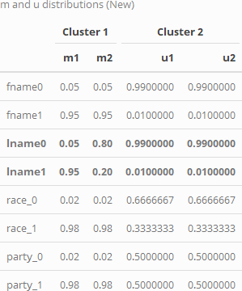
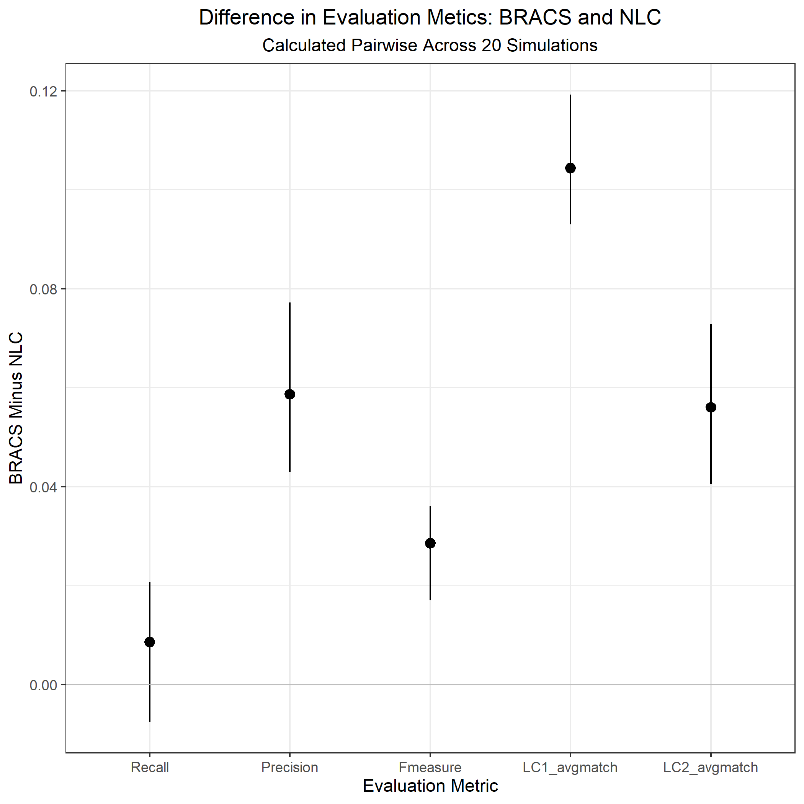

```{r setup, include=FALSE}
knitr::opts_chunk$set(echo = FALSE, out.height = "80%", out.width = "80%",
                      fig.align = 'center')

library(knitr)
```

## New Distributions

I tried out some new distributions to more closely mirror the voter registration context. Here, I am using first name, last name, race, and party. The $u$ parameters for all of these are somewhat fixed, but the $m$ can be adjusted to weaken or strengthen the variable. When I tried a 5th variable, I ran into the same problem where there was too much information in the data, so you couldn't clearly see the effects of BRACS.

```{r}

```

## Results

As mentioned before, we see a substantial increase in precision, which also leads to an increase in fmeasure. For the average link probabilities, I split the records by their linkage cluster, looked at the declared matches, and took an average of those posterior match probabilities. On their own, these probabilities do not tell us much, since they could just indicate we are more confident in wrong decisions. However, since we see an increase in fmeasure, I think these numbers are useful. Also, there may be better ways to report or calculate this information, so I'll keep thinking about it. 

```{r}

```

