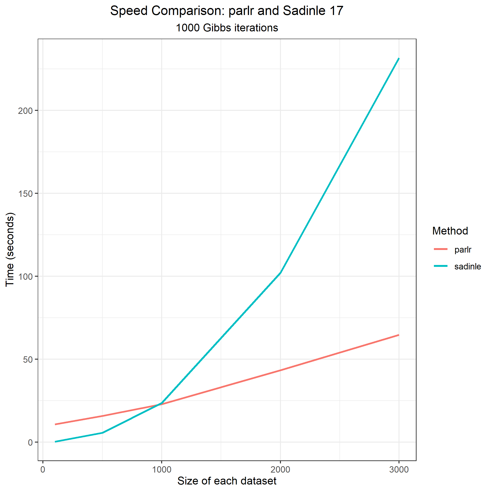
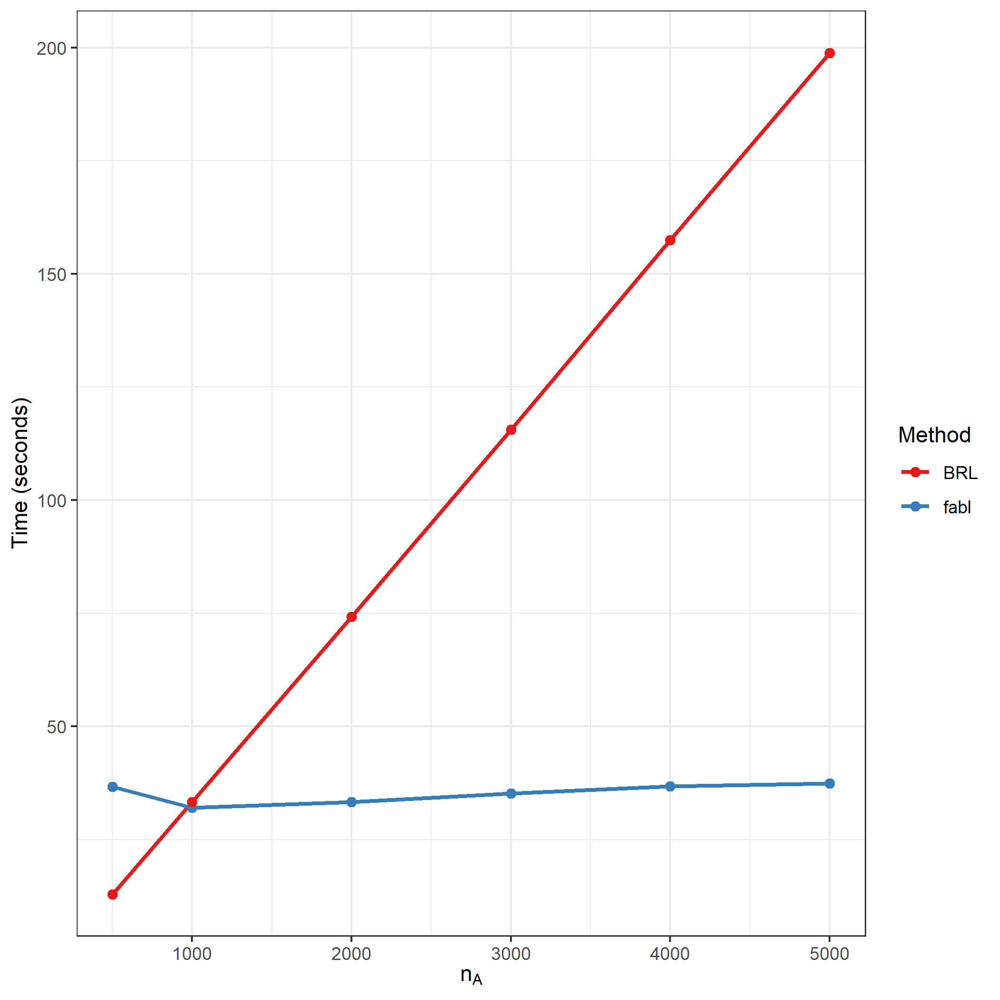
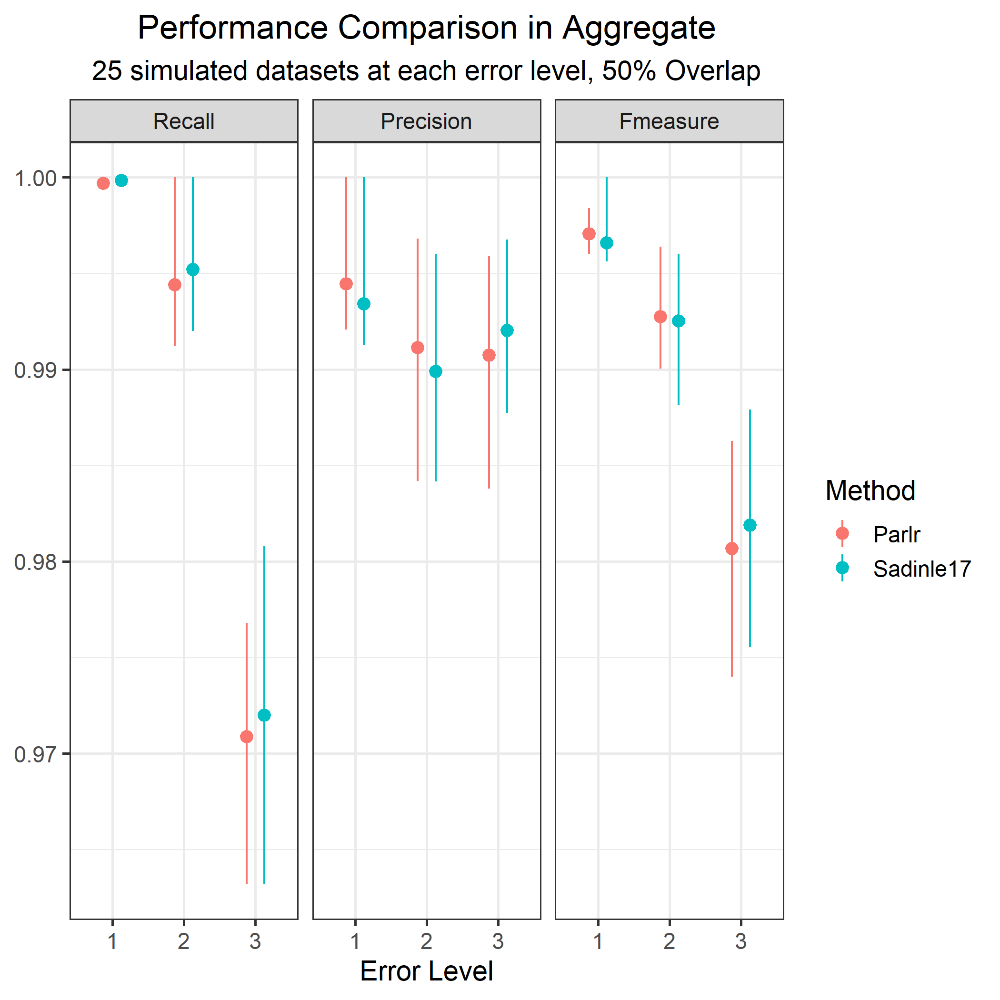

```{r setup, include=FALSE}
knitr::opts_chunk$set(echo=FALSE, out.height="80%", out.width="80%", fig.align = 'center')
library(RecordLinkage)
library(tidyverse)
```

## Overview

- Computational Speed-ups
- Next Step

## parlr

- I have been playing around with calling my method "\underline{Pa}rallelized \underline{R}ecord \underline{L}inkage in \underline{R}", or parlr for short.

- Broadly speaking, I use two strategies for computational speedup:
  - Performing operations on the **unique aggreement patterns** rather than the individual record pairs. Rigorously, sums over the unique patterns are *sufficient statistics*.
  - Relaxation of one to one matching to allow for parallel sampling of $Z$
  
Together, these have made **huge** improvements on code

## Identifying Unique Patterns

- Enamorado uses the following hashing function to identify unique aggreement patterns. I've also figured out how to do this efficiently in `dplyr`.

$$H(i,j) = \sum_{f=1}^F \mathbf{1}_{\gamma_f (i,j) >0}2^{\gamma_f (i,j) + \mathbf{1}_{f>1} \times \sum_{a=1}^{f-1}(L_a -1)}$$

- I identify the unique patterns, the number of each of of those patterns in the data as a whole, and the number of those patterns for each record $j \in B$.

- Define $P$ to be the number of unique agreement patterns, and note it is bounded by $\prod_{f =1}^F L_f$. This *does not grow* with the size of the data.

## Calculating FS weights

- Within a Gibbs iteration, all records with the same agreement pattern will have the same FS weight. So instead of calculating the weight for each of $n_A \times n_B$ records, I only need to do it for $P$ unique patterns.

- This step is taken directly from `fastlink`. 

## Identifying Unique Patterns

- `fastlink` doesn't have posterior updates for Dirichlet distributions, so I came up with this step on my own.

- Each agreement pattern corresponds to a particular type of contribution to the posteriors of the $m$ and $u$ parameters. 

- To update $m$, I used to sum over each variable for all $N$ record pairs. Now, I simply identify the number of matchings in the $Z$ vector corresponding to each of $P$ patterns.

- The nonmatches are even easier: just substract this number from the total present in the data!

## Breaking up the Z sampler

- Four observations
  - Sampling many objects with varying probabilities difficult
  - Sampling *fewer* objects with varying probabilities is easy
  - Sampling many objects with *uniform* probabilities is also easy
  - For a record $j \in B$, each record $i\in A$ with a given agreement pattern has the same probability of matching. That is, the unique patterns form *equivalence classes*, and within a class, each record is equally likely.
  
## Breaking up the Z sampler

- Rather than sampling $Z_j$ sequentially from $N$ many records, I can sample it in parallel from $P$ many equivalence classes of unique patterns, each one multiplied by its prevalance for record $j$.

- After sampling the unique pattern, I sample the record associated with that pattern uniformly at random. 

- Since all calculations within the Gibbs Sampler depend only on the unique pattern, and since my model samples the $Z_j$ independently,  I can sample for the records *at the end of the entire Gibbs procedure*

## Summary

- We have *almost entirely* removed dependence on $N$ from our Gibbs procedure, and replaced them with steps that depend on $P$.

- Only major hurdle with $N$ is calculating the comparison vectors, which is just unavoidable in the Fellegi Sunter Framework. However, whatever Ted does for `fastlink` would work here too.

- Filling in the Gibbs sampler post-hoc technically depends on $N$, but its a very inexpensive step that only has to be done once

## Speed up

```{r}

```

## Speed up

- When $n_A$ and $n_B$ are small, the computational savings are minimal, and Sadinle's `BRL` runs faster just because its in C.

- As the datasets grow bigger, computation for `BRL` grows *quadratically*, while `parlr` seems to grow *linearly*

- The plot shown is with **no parallel computing**

- If my method was programmed in C, I would expect even greater computational savings

## More on Speed Up

- Within the Gibbs sampler, calculations only depend on $n_B$ (the number samples I need to take to fill a $Z$ vector), and $P$ (the number of unique patterns). $n_A$ only influences the scale of the counts for the unique patterns. 

- $n_A$ only comes to play in forming the comparison vectors and in back-filling the samples of $Z$ at the end of the sampler.

- This suggests that the sampler should be *almost constant* in $n_A$ (ie, the Gibbs sampling for a $4000 \times 500$ problem should not be substantially longer than for a $500 \times 500$ problem)

- Particularly useful for linking a smaller dataset to a much larger dataset. One example would be the DNC data in BRACS!

## More on Speed Up

```{r}

```


## Accuracy

```{r}

```

## Accuracy

```{r}
knitr::include_graphics("figures/acc_plot_pairwise.png")
```

## Accuracy

- Overal, the `parlr` method peforms comparably to Sadinle17. There is slight evidence that recall is systematically lower for `parlr` at high error levels, but it is *very* slight. I'll need to run this at different level of overlap to explore more.

## Limitations

- The original FS method is $O(n_A \times n_B)$ hard. With hashing methods, `fastlink` makes the problem only $O(P)$ hard, since record pairs are considered indepenently and classification is based *only* on the unique pattern. 

- Hashing methods in my model make the problem $O(n_B \times P)$ hard. No matter what, I need to sample $n_B$ many times to fill a linkage vector $Z$. In this sense, `fastlink` is inherently faster than this method

- However, method takes into consider much more of the dependency structure in the data, making this computational burden worthwhile

- \textcolor{blue}{Note:} If this line of thinking is useful for the paper, I'll need some help making this rigorous!

## Next Steps

- I have not yet implemented any parallelization. We will cover this soon is Shawns class. The steps above however provide *the vast majority* of the computational speed up. 

- Later on, I'll be able to use this same hashing function for linkage clusters by replacing 2 with the $k^{th}$ prime number for the $k^{th}$ linkage cluster. (For Jody's paper, I'll present just the standard method)

## Next Steps

- This model and these computational savings really inform everything everything I'm doing. Apart from the BRACS paper with Jody, I'm really going to focus on getting this done

- Larger versions of the simulations above, with different levels of overlap.

- \textcolor{blue}{Question:} What other kinds of simulations or evaluations would I need? 

- \textcolor{blue}{Question:} Is this still a good fit for Bayesian Analysis? Or should it go to a journal more concerned with computation and scalability?


