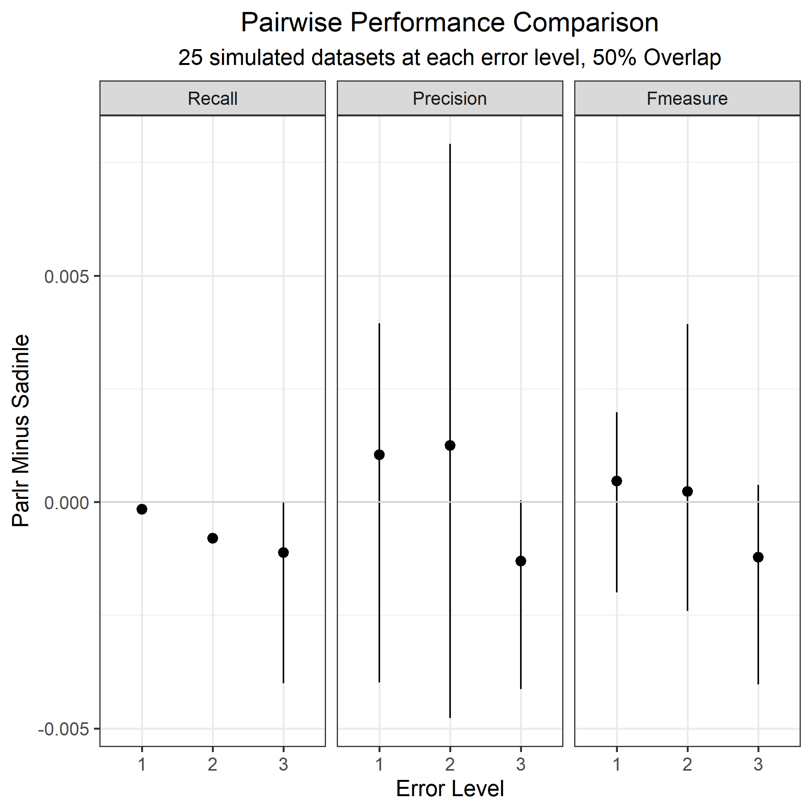

```{r setup, include=FALSE}
knitr::opts_chunk$set(echo=FALSE, out.height="80%", out.width="80%", fig.align = 'center')
library(RecordLinkage)
library(tidyverse)
```

## Overview

- Computational Speed-ups
- Next Step

## parlr

- I have been playing around with calling my method "\underline{Pa}rallelized \underline{R}ecord \underline{L}inkage in \underline{R}", or parlr for short.

- Broadly speaking, I use two strategies for computational speedup:
  - Performing operations on the **unique aggreement patterns** rather than the individual record pairs. Rigorously, sums over the unique patterns are *sufficient statistics*.
  - Relaxation of one to one matching to allow for parallel sampling of $Z$
  
Together, these have made **huge** improvements on code

## Identifying Unique Patterns

- Enamorado uses the following hashing function to identify unique aggreement patterns

$$H(i,j) = \sum_{f=1}^F \mathbf{1}_{\gamma_f (i,j) >0}2^{\gamma_f (i,j) + \mathbf{1}_{f>1} \times \sum_{a=1}^{f-1}(L_a -1)}$$

- I identify the unique patterns, the number of each of of those patterns in the data as a whole, and the number of those patterns for each record $j \in B$.

- Define $P$ to be the number of unique agreement patterns, and note it is bounded by $\prod_{f =1}^F L_f$.

## Identifying Unique Patterns

- Each agreement pattern corresponds to a particular type of contribution to the posteriors of the $m$ and $u$ parameters. 
- To update $m$, I used to sum over each variable for all $N$ record pairs. I simply identify the number of matchings in the $Z$ vector corresponding to each agreement of $P$ patterns.

- The nonmatches are even easier: just substract this number from the total present in the data!

## Calculating FS weights

- Again, I used to do this for each of $N$ records, but now I calculate this for the $P$ unique patterns.

- Just these two changes sped up the code considerably. However, I thought of one other clever trick to really push this idea to the max. 

## Breaking up the Z sampler

- Four observations
  - Sampling many objects with varying probabilities difficult
  - Sampling *fewer* objects with varying probabilities is easy
  - Sampling many objects with *uniform* probabilities is also easy
  - For a record $j \in B$, each record $i\in A$ with a given agreement pattern has the same probability of matching. That is, the unique patterns form *equivalence classes*, and within a class, each record is equally likely.
  
## Breaking up the Z sampler

- Rather than sampling $Z_j$ from $N$ many options, I instead sample it from the $P$ unique patterns, each one multiplied by its prevalance for record $j$.

- After sampling the unique pattern, I sample the record associated with that pattern uniformly at random. 

- Since all calculations within the Gibbs Sampler depend only on the unique pattern, and since my model samples the $Z_j$ independently,  I can sample for the records *at the end of the entire Gibbs procedure*

## Summary

- We have *almost entirely* removed dependence on $N$ from our Gibbs procedure, and replaced them with steps that depend on $P$.

- Filling in the Gibbs sampler post-hoc technically depends on $N$, but its a very inexpensive step that only has to be done once

- Only major hurdle with $N$ is calculating the comparison vectors, which is just unavoidable in the Fellegi Sunter Framework

## Speed up

```{r}

```

## Speed up

- When $n_A$ and $n_B$ are small, the computational savings are minimal, and Sadinle's `BRL` runs faster just because its in C.

- As the datasets grow bigger, computation for `BRL` grows *quadratically*, while `parlr` seems to grow *linearly*

- The plot shown is with **no parallel computing**

- If my method was programmed in C, I would expect even greater computational savings

## Accuracy

```{r}
knitr::include_graphics("figures/acc_plot.png")
```

## Accuracy

```{r}

```

## Accuracy

- Overal, the `parlr` method peforms comparably to Sadinle17. There is slight evidence that recall is systematically lower for `parlr` at high error levels, but it is *very* slight. I'll need to run this at different level of overlap to explore more.

## Next Steps

- I have not yet implemented any parallelization. We will cover this soon is Shawns class. The steps above however provide *the vast majority* of the computational speed up. 

- Later on, I'll be able to use this same hashing function for linkage clusters by replacing 2 with the $k^{th}$ prime number for the $k^{th}$ linkage cluster. (For Jody's paper, I'll present just the standard method)

## Next Steps

- This model and these computational savings really inform everything everything I'm doing. Apart from the BRACS paper with Jody, I'm really going to focus on getting this done

- Larger versions of the simulations above, with different levels of overlap.

- \textcolor{blue}{Question:} What other kinds of simulations or evaluations would I need? 

- \textcolor{blue}{Question:} Is this still a good fit for Bayesian Analysis? Or should it go to a journal more concerned with computation and scalability?


