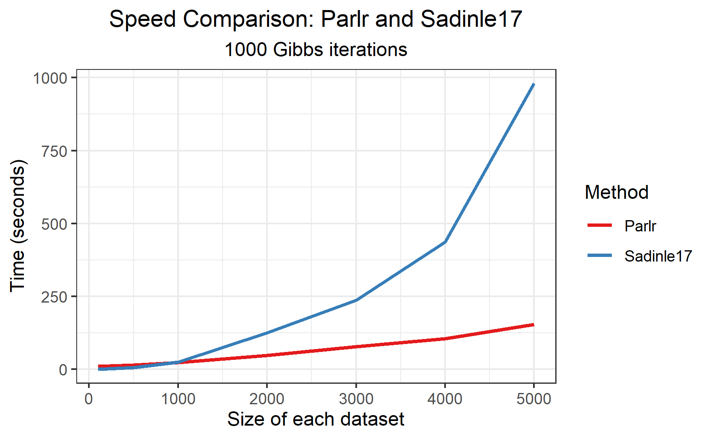
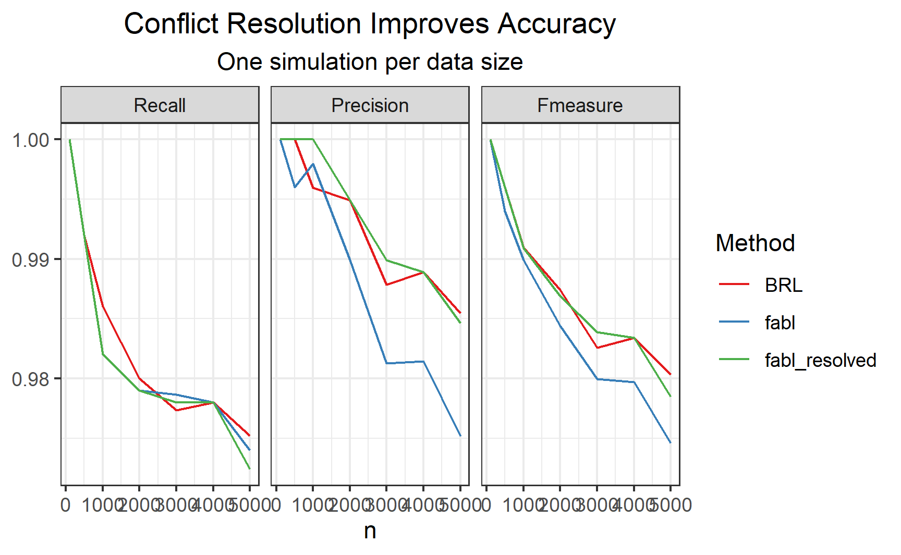

```{r setup, include=FALSE}
knitr::opts_chunk$set(echo=FALSE, out.height="80%", out.width="80%", fig.align = 'center')
library(RecordLinkage)
library(tidyverse)
```

## Overview

- Completed Sadinle Simulation
- Revisiting $n$
- Conflict Resolution

## Sadinle Simulation

- I have completely replicated the Sadinle simulation using `parlr` and `BRL`
- Three levels of error, three levels of overlap, 100 simultations each. Total of 900 simulations

## Sadinle Simulation

```{r}
knitr::include_graphics("figures/sadinle_sim_plot.png")
```

## Sadinle Simulation

- `parlr` shows notably weaker performance only in very high error levels and very high overlap

- This makes sense: the discrepancy between `parlr` and `BRL` will be greatest with high overlap, because this is when `BRL` is removing the most records from the set of potential matches

## Revisiting n

- Last meeting, I had a plot showing the computational savings of `parlr` for different sizes of the data

- Jerry asked whether `parlr` was maintaining comparable performance for the larger datasets. I prematurely said yes.

## Revisiting n

```{r}

```

## Revisiting n

```{r}

```

## Whats going on?

- Combing through the results, I realized that this discrepancy was due to pairs that violate one-to-one matching. Such pairings are not possible under `BRL`, but are possible with `parlr`

- Worse, the rate of such matchings occuring *increases* with the size of the data

## Violations of One-to-One

```{r}

```


## Violations of One-to-One

- This makes sense: all of the nonmatching pairs are generated from the $\mathbf{u}$ distriutions. Simulating "strong" comparison vectors is rare under $\mathbf{u}$, but the chance of simulating *at least one* strong comparison vector to compete with the true match increases with $n_A$

- I also think that this phenomenon might not occur as strongly with real data. Generating comparison vectors themselves is not very close to reality. 

- This might be something I want to bring up with Jody/DNC at some point though. (All of that has been pretty quiet recently)


## Conflict Resolution

- The Fellegi-Sunter methods all have a method of conflict resolve to create one-to-one matching posthoc. 

- Here, this can simply be done by accepting the match with the highest posterior probability. Rigorously, this indeed minimizes the Bayes risk, since we are assuming only one match can be true. (Might need to make this more rigorous)

- I expect that the number of conflicts to be resolved under this method is *far lower* than under `fastlink`.

## Conflict Resolution

```{r}

```

## Next Steps

- Eventually, I should redo the Sadinle Simulation with the conflict resolution step

- An alternative approach to the conflict resolution step might be an **active learning** method, where the user detects pairs that violate one-to-one matchings while the process is going on. 

- Recieved El Salvador data from Beka, haven't looked at it yet

- Using these ideas for my final project in Eric Laber's class
