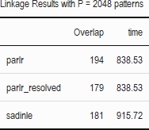
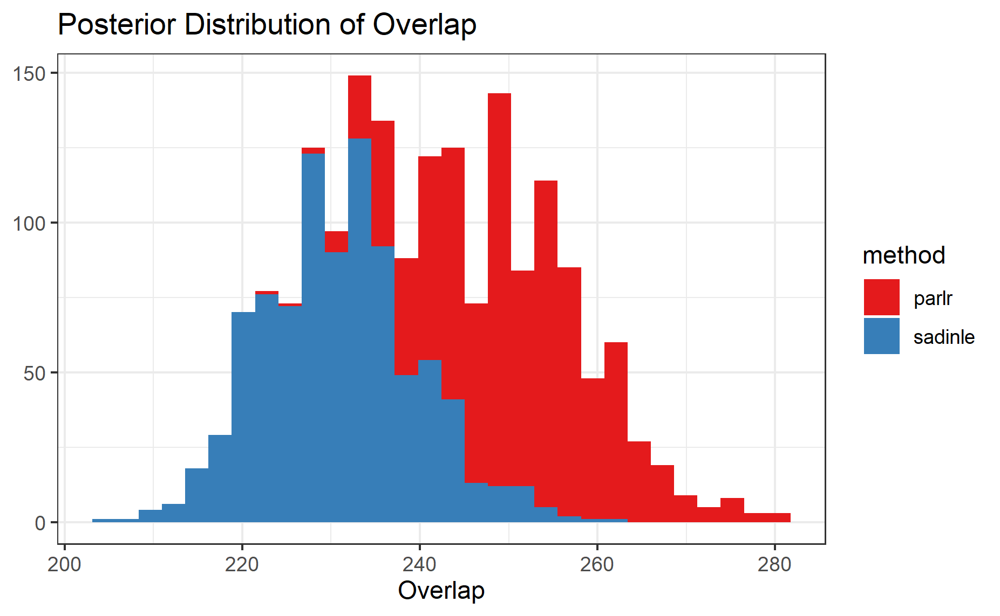
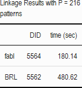
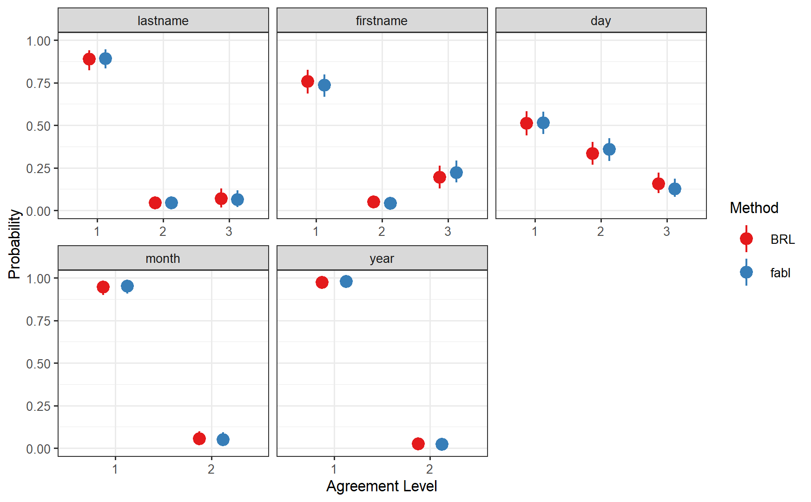
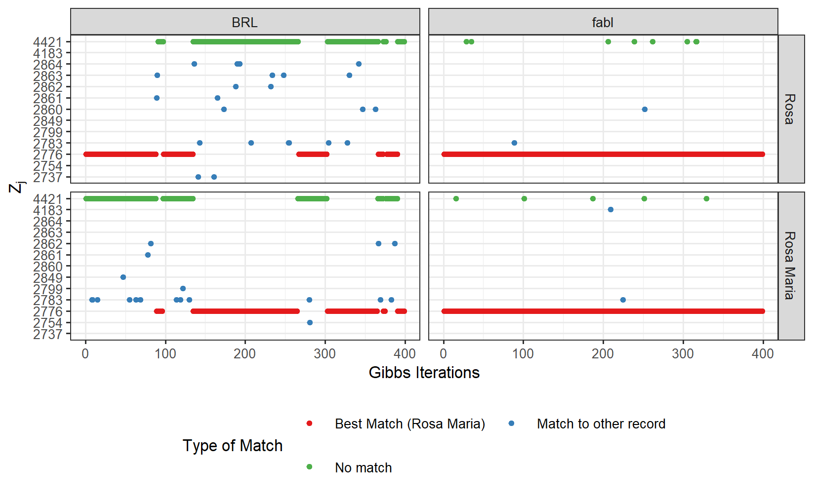

```{r setup, include=FALSE}
knitr::opts_chunk$set(echo = FALSE, out.height = "80%", out.width = "80%",
                      fig.align = 'center')

library(knitr)
```

# El Salvador Data: Parlr vs Sadinle17

I've attempted to reproduce the results from Sadinle's 2017 paper, which has been a little bit of a mixed bag. The code that Beka gave me does not seem to be the same that is used in the actual 2017 paper. I think this for two reasons:

- Code involves three datasets (ER, CHDES, and UNTC), while paper only links two (ER and CHDES)
- There is code for priors for "truncation points" which are used in Sadinle's 2014 model.

Nevertheless, I proceeded. For a first run-through, I tried to build the comparison vectors in the exact same way that Sadinle did. He uses 4 levels for many fields, which I'll discuss more later. Also, his paper calls for three agreement levels for location of death (exact municipality, adjacent municipality, nonmatch), but the code I have doesn't do that, and that would be pretty difficult to implement. So I just use binary comparisons.

My results are close, but not identical to what's provided in the Sadinle paper.

- After data cleaning, my ER dataset has 1323 records, while the paper says there should be 1324. 
- The paper has a Bayes estimate with 187 links, but my implementation (with `BRL`) finds 180. This might be because the paper detects adjacent municipalities, while I do not.
- Distribution of $m$ parameters for given name is a bit different from whats in the paper. 

I can go more into details about these things, but for the moment, I'm more concerned with comparing the results of `BRL` and `parlr` in my own implementation, rather than reproducing Sadinle17 exactly. 

## Using Sadinle's Levels

The table below shows the amount of overlap detected by each method, as well as the time it took for the linkage to run. Interestingly, since Sadinle uses so many levels per field, we have $4^5 \times 2^2 = 4096$ possible unique patterns, so I was worried that `parlr` wouldn't give the desired speedups. However, only 352 patterns are actually realized, so `parlr` goes pretty fast!


```{r}

```


Below is the posterior distribution of the overlap between the files. We see that `parlr` typically matches me, which is to be expected; at minimum, there are the 13 matches that `parlr` made that violated one-to-one matching which Sadinle avoids. For two reasons, I do not consider this to be a problem.


```{r}

```

- Within the Sadinle framework, it is typical that Gibbs iterations have more matches than the eventual Bayes estimate. This is because many of the matches are due to randomness, and they only make it through to the Bayes estimate if that same matching occurs consistently 50% of the time. In Sadinle's paper, the overlap has a mean of 241, and a 90% credible interval of [227, 256], but a Bayes estimate of only 187.

- Severe overmatching within the Gibbs iterations can possibly lead to biased posteriors for the $m$ parameters. There is an interesting conversation to be had here. When Enamorado compared `fastlink` to `BRL`, he notes that the first estimate under `fastlink` has way too many matches, but that `fastlink` produces similar results to `BRL` after resolving all the matches that violate one-to-one. While this is true, the overmatching within his EM algorithm lead to biases in the $m$ parameters, and these can not be cleaned up posthoc. In the Sadinle paper, he notes that the FS method leads to nonsensical estimates of the $m$ parameters, and I believe it is for this reason.

This led to me worry that parameter estimates under `parlr` would be similarly biased. However, good news, they are not! This is because the overmatching under `parlr` is very slight compared to `fastlink`.

```{r}
include_graphics("../notes/figures/el_salvador/m_posterior_bigP.png")
```

Looking at these $m$ parameters, we see that many levels are redundant. Also, since less that 10% of the possible patterns are realized, it really does seems like that many levels are unneccesary.  So now we're going to run `parlr` with fewer levels and see how things change. 

## Using Less Patterns

I reran everything with only 3 levels for first name, last name, and day, and only 2 levels for everything else. I probably could use just two levels for the names since the code puts so much work into standardizing names and using a modified Levenstein distance, but for now, I'll stick with 3 levels. Here $P$ is bounded by 216, and only 159 unique patterns are realized. Results stay basically the same, but see significant speed up for `parlr`.


```{r}

```


```{r}
include_graphics("../notes/figures/el_salvador/overlap_distribution_smallP.png")
```


```{r}

```

<!-- ## Limitations of parlr -->

<!-- Doing this analysis made me realize a limitation of this `parlr` method. When you have many many fields and levels, you can have situations where $P > n_A$, which means that doing calculations over all possible patterns will actually be slower than the standard method. Of course, there will only be at most $n_A$ realized patterns (and probably less than that ), but computational saving will only be significant when $P << n_A$. -->

<!-- One other issue regarding the size of $P$: Numerically, missing values lead to another unique pattern. Consider the previous examples with 5 fields with only 2 agreement levels, yeilding $P = 2^5 =32$ unique patterns. If there is at even one missing value for each of the fields, this would lead to $P = 3^5 =243$ unique patterns. For large $n_A$ this is still a big savings, but its important to note how quickly $P$ can grow, especially with regards to missing values. -->

<!-- (Sadinle's `BRL` incorrectly classifies all missing values as disagreements. Adopting this would help keep $P$ small, but is bad for tons of different reasons.) -->

## Mixing and Multiple Possible Matches

Something interesting about this comparison is that this dataset is specifically an example where `parlr` and Sadinle would differ the most. In cases were there multiple plausible matches, each method produces undesirable behavior. For example, examine the records of Rosa and Rosa Maria in the CDHES dataset. 


```{r}
include_graphics("../notes/figures/el_salvador/rosa_records.png")
```

- In `parlr` both records in $B$ match to the same record in $A$ throughout the Gibbs process, creating consistent violations of one-to-one matching.

- In Sadinle, the Gibbs process creates one matching status and stays there for a while, but if one pair "unmatches," then the other record has a chance to latch on. Then the Gibbs process is stuck with that matching status for a while. This seems to be poor mixing. 

```{r}

```

As a result, `parlr` provides an initial Bayes Estimate (without conflict resolution) with two matches, each with high posterior probability (90% +) The modeller can algorithmically take the one with highest posterior, or examine the records manually. Sadinle provides only one match (consistent with 1-1 matching), with low posterior probability (a bit above 50%).

I used to think this behavior made the El Salvador data a bad option for my case study, but I think its actually instructive to examine this closely. Let me know your thoughts on this!

(PS, it took me forever to figure out how to represent this visually!)

## Questions

Is still a good case study to choose? The first thing that worries is that I have't been able to 100% replicate Sadinle's results. Let me know if you think this is an issue.

The second thing that worries me is this dataset is precisely one where Sadinle and `parlr` would have the largest discrepancy; the material discussed in the section above. 
