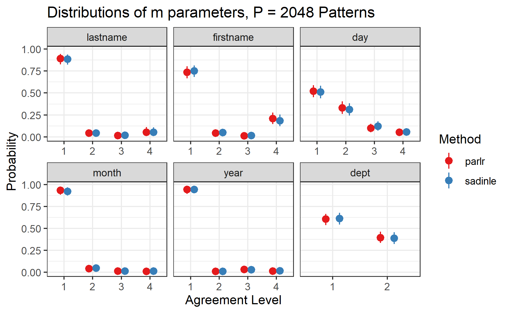

```{r setup, include=FALSE}
knitr::opts_chunk$set(echo = FALSE, out.height = "80%", out.width = "80%",
                      fig.align = 'center')

library(knitr)
```

# El Salvador Data: Parlr vs Sadinle17

I've attempted to reproduce the results from Sadinle's 2017 paper, which has been a little bit of a mixed bag. The code that Beka gave me does not seem to be the same that is used in the actual 2017 paper. I think this for two reasons:

- Code involves three datasets (ER, CHDES, and UNTC), while paper only links two (ER and CHDES)
- Code creates comparison matrix that is not compatible with BRL

Nevertheless, I proceeded. For a first run-through, I tried to build the comparison vectors in the exact same way that Sadinle did. He uses 4 levels for many fields, which I'll discuss more later. Also, his paper calls for three agreement levels for location of death (exact municipality, adjacent municipality, nonmatch), but the code I have doesn't do that, and that would be pretty difficult to implement. So I just use binary comparisons.

My results are close, but not identical to what's provided in the Sadinle paper.

- After data cleaning, my ER dataset has 1323 records, while the paper says there should be 1324. 
- The paper has a Bayes estimate with 187 links, but my implementation (with `BRL`) finds 178. This might be because the paper detects adjacent municipalities, while I do not
- Distribution of $m$ parameters for given name substantially different from whats in the paper. 

I can go more into details about these things, but for the moment, I'm more concerned with comparing the results of `BRL` and `parlr` in my own implementation, rather than reproducing Sadinle17 exactly. 

## Bad News: More Patterns More Problems

The table below shows the amount of overlap detected by each method, as well as the time it took for the linkage to run. You'll notice that `parlr` is *significantly* slower than `BRL` here. 


```{r}
include_graphics("../notes/figures/el_salvador/time_table_big_P.png")
```

However, this is largely because Sadinle uses 4 level of agreement for most of the fields, leading to $P = 4096$. Given that $n_A = 4420$, `parlr` will give almost no computational savings in this context. Still however, lets examine the results

Below is the posterior distribution of the overlap between the files. We see that `parlr` typically matches me, which is to be expected; at minimum, there are the 13 matches that `parlr` made that violated one-to-one matching which Sadinle avoids. For two reasons, I do not consider this to be a problem.


```{r}
include_graphics("../notes/figures/el_salvador/overlap_distribution_bigP.png")
```

- Within the Sadinle framework, it is typical that Gibbs iterations have more matches than the eventual Bayes estimate. This is because many of the matches are due to randomness, and they only make it through to the Bayes estimate if that same matching occurs consistently 50% of the time. In Sadinle's paper, the overlap has a mean of 241, and a 90% credible interval of [227, 256], but a Bayes estimate of only 187.

- Severe overmatching within the Gibbs iterations can possibly lead to biased posteriors for the $m$ parameters. There is an interesting conversation to be had here. When Enamorado compared `fastlink` to `BRL`, he notes that the first estimate under `fastlink` has way too many matches, but that `fastlink` produces similar results to `BRL` after resolving all the matches that violate one-to-one. While this is true, the overmatching within his EM algorithm lead to biases in the $m$ parameters, and these can not be cleaned up posthoc. In the Sadinle paper, he notes that the FS method leads to nonsensical estimates of the $m$ parameters, and I believe it is for this reason.

This led to me worry that parameter estimates under `parlr` would be similarly biased. However, good news, they are not! This is because the overmatching under `parlr` is very slight compared to `fastlink`

```{r}

```

This comparison of $m$ parameters also makes me more convinced that Sadinle is using way too many levels per field. So now we're going to run `parlr` with fewer levels and see how things change. 

## Good News: Less Patterns Less Problems

I reran everything with only 3 levels for first name, last name, and day, and only 2 levels for everything else. This yields $P = 432$.


```{r}
include_graphics("../notes/figures/el_salvador/time_table_small_P.png")
```


```{r}
include_graphics("../notes/figures/el_salvador/overlap_distribution_smallP.png")
```


```{r}
include_graphics("../notes/figures/el_salvador/m_posterior_smallP.png")
```

## Limitation of parlr

Doing this analysis made me realize a limitation of this `parlr` method. When you have many many fields and levels, you can have situations where $P > n_A$, which means that doing calculations over all possible patterns will actually be slower than the standard method. Of course, there will only be at most $n_A$ realized patterns (and probably less than that ), but computational saving will only be significant when $P << n_A$.

One other issue regarding the size of $P$: Numerically, missing values lead to another unique pattern. Consider the previous examples with 5 fields with only 2 agreement levels, yeilding $P = 2^5 =32$ unique patterns. If there is at even one missing value for each of the fields, this would lead to $P = 3^5 =243$ unique patterns. For large $n_A$ this is still a big savings, but its important to note how quickly $P$ can grow, especially with regards to missing values.

(Sadinle's `BRL` incorrectly classifies all missing values as disagreements. Adopting this would help keep $P$ small, but is bad for tons of different reasons.)

## Questions

Is still a good case study to choose? Consider that:

- I haven't been able to exactly reproduce the results from the Sadinle paper
- This doesn't show off the computational gains of `parlr`

I think its nice that it demonstrates the influence of the $P$ patterns, but I'm not sure if that's enough. Let me know your thoughts on this!

