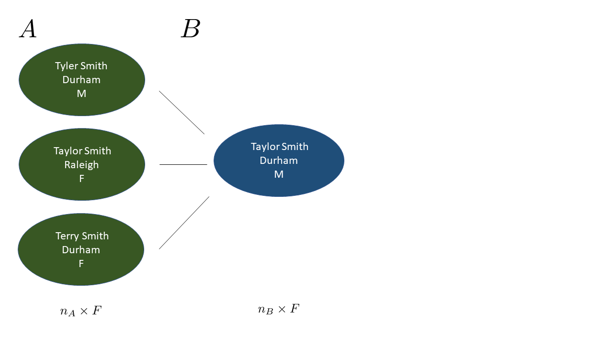

```{r setup, include=FALSE}
knitr::opts_chunk$set(echo=FALSE, out.height="80%", out.width="80%", fig.align = 'center')
library(RecordLinkage)
library(tidyverse)
```

## Overview

- Many record linkage methods are derived from Fellegi and Sunter's "A Theory for Record Linkage" (1969)

- Transform the $F$ fields of information among the $n_A$ records in File $A$ and the $n_B$ records in File $B$ into a $n_A n_B \times F$ matrix of comparison vectors $\Gamma$.

- Comparisons for each field $f$ are binned to integers $\{1, \ldots, L_f\}$, with 1 being the highest level of agreement

  - Common to use $\{1, 2\}$ to reflect exact agreement or disagreement, and $\{1, 2, 3\}$ to allow for partial agreement
  
## Comparison Vector Example

```{r}

```

## Comparison Vector Example

```{r}
knitr::include_graphics("figures/gamma_example_2.png")
```

## Modelling Comparison Vectors

- Comparison vectors are modelled though *reliability* parameters $\mathbf{m} = (\mathbf{m}^1, \ldots, \mathbf{m}^{F})$ and *discernment* parameters $\mathbf{u} = (\mathbf{u}^1, \ldots, \mathbf{u}^{F})$

- $m^{fl} = P(\gamma^f = l|\text{Match})$ and $u^{fl} = P(\gamma^f = l|\text{Nonmatch})$

- $m_{ij} = P(\boldsymbol{\gamma}_{ij}|\text{Match}) =  \prod_{f=1}^{F}\prod_{l=1}^{L_f} m^{fl} \times I(\gamma_{ij}^f = l)$

- $u_{ij}$ defined similarly

- $w_{ij} = \frac{m_{ij}}{u_{ij}}$, the *Fellegi-Sunter weight*

## Modelling Linkage Structure

- To indicate matching status, we adopt the *linkage structure parameter* $\mathbf{Z} = (Z_1, \ldots, Z_{n_B})$ defined as
$$Z_j=\begin{cases} 
    i,  & \text{if records } i\in A \text{ and } j\in B \text{ refer to the same entity}; \\
    n_A + 1,  & \text{if record } j\in B \text{ does not have a match in file } A; \\
\end{cases}$$

- More efficient than a $n_A \times n_B$ matrix

## Modelling Linkage Structure

- Fellegi-Sunter (1969) made *independent* classification decisions for all $n_A n_B$ record pairs. 

- Sadinle (2017) made *dependent* matching decisions for the $n_B$ records in $B$, strictly enforcing one-to-one matching

- With Fast Beta Linkage (`fabl`, pronounced "fable") We make *independent* matching decisions for the $n_B$ records in $B$, which sometimes violates one-to-one, but allows for much faster computation

<!-- - $\lambda:= P(Z_j < n_A + 1)$ is the marginal probability that a record in $B$ has some match in $A$ -->

## Model Specification

For fields $f \in \{1, \ldots, F\}$ and levels $l\in \{1, \ldots, L_f\}$ we adopt the following likelihood and prior distributions. 

$$P(\Gamma|\mathbf{Z}, \mathbf{m}, \mathbf{u}, \lambda) =\prod_{j=1}^{n_B}  \prod_{i=1}^{n_A}\mathbf{m}_{ij}^{\mathbf{1}_{z_j = i}}\mathbf{u}_{ij}^{\mathbf{1}_{z_j \neq i}}$$
$$\mathbf{m^{f}} \sim \text{Dirichlet}(\alpha^{f1}, \ldots, \alpha^{fL_f})$$
$$\mathbf{u^{f}} \sim \text{Dirichlet}(\beta^{f1}, \ldots, \beta^{fL_f})$$
$$Z_j | \lambda =
\begin{cases} 
    \frac{1}{n_A}\lambda  & z_j \leq n_A; \\
     1-\lambda &  z_j  = n_A + 1 \\
\end{cases}$$
$$\lambda \sim \text{Beta}(\alpha_{\lambda}, \beta_{\lambda}) $$

## Gibbs Sampling

- $\mathbf{m}$, $\mathbf{u}$, and $\lambda$ are standard multinomial-dirichlet and beta-binomial updates

- We sample $Z_j$ independently from all other $Z_{j'}$, but dependent on the $\mathbf{Z}$ vector from the previous iteration. The full conditional is

$$P\left(Z_j^{(s+1)}  = i| \mathbf{m}, \mathbf{u}, \mathbf{Z^{(s)}}\right) \propto
\begin{cases} 
    w_{ij}  & i \leq n_A; \\
     n_A \frac{n_B - D + \beta_{\lambda}}{D + \alpha_{\lambda}} & i  = n_A + 1 \\
\end{cases}$$

## Efficient Computation

- Let $\mathcal{H} = \{h_1, \ldots, h_P\}$ be the set of unique agreement patterns in the data. Note that $P \leq \prod_{f = 1}^F L_f$.

- When the $(i,j)$ pair exhibits the $p^{th}$ agreement pattern, we say $(i,j) \in h_p$

- Wherever possible, utilize $P << n_A$ to speed up computation

## Efficient Computation

- Rather than compute $w_{ij}$ for all $n_A n_B$ record pairs, we can compute $w_p$ for each agreement pattern.

- $H_p = \sum_{i=1}^{n_A}\sum_{j=1}^{n_B} \mathbf{1}_{(i,j) \in h_p}$, the total instances of agreement pattern $p$ throughout the data. Use this to speed up posterior updates for $\mathbf{m}$ and $\mathbf{u}$.

- For each $j$, calculate $H_{p_j} = \sum_{i=1}^{n_A} \mathbf{1}_{{(i,j) \in h_p}}$ the instances of agreement pattern $p$ among the comparison vectors between record $j \in B$ and each of the $n_A$ records in $A$. Use this to speed up sampling of $\mathbf{Z}$

## Breaking Up the Z Sampler

- Sampling $n_A$ objects with varying probabilities difficult
- Sampling $P$ objects with varying probabilities is easy
- Sampling $H_{p_j}$ (can be very large) objects with *uniform* probabilities is also easy
- For a record $j \in B$, each record $i\in A$ with a given agreement pattern has the same probability of matching. That is, the unique patterns form *equivalence classes*, and within a class, each record is equally likely.

## Breaking Up the Z Sampler

- More concretely, define $h(Z_j)$ to be the agreement pattern between $j$ and its potential match, and say $h(Z_j) = h_{P+1}$ when $Z_j = n_A + 1$. We sample the agreement pattern through:

$$h\left(Z_j^{(s+1)}\right) | \mathbf{m}, \mathbf{u}, \mathbf{Z^{(s)}} \propto
\begin{cases} 
    w_{p}\times H_{p_j}  & p \leq P; \\
     n_A \frac{n_B - D + \beta_{\lambda}}{D + \alpha_{\lambda}} &   p = P + 1 \\
\end{cases}$$

- Then, we sample the record for the match uniformly among candidate records

## Speed Gains

```{r}
knitr::include_graphics("figures/sadinle_speed_plot2.png")
```


