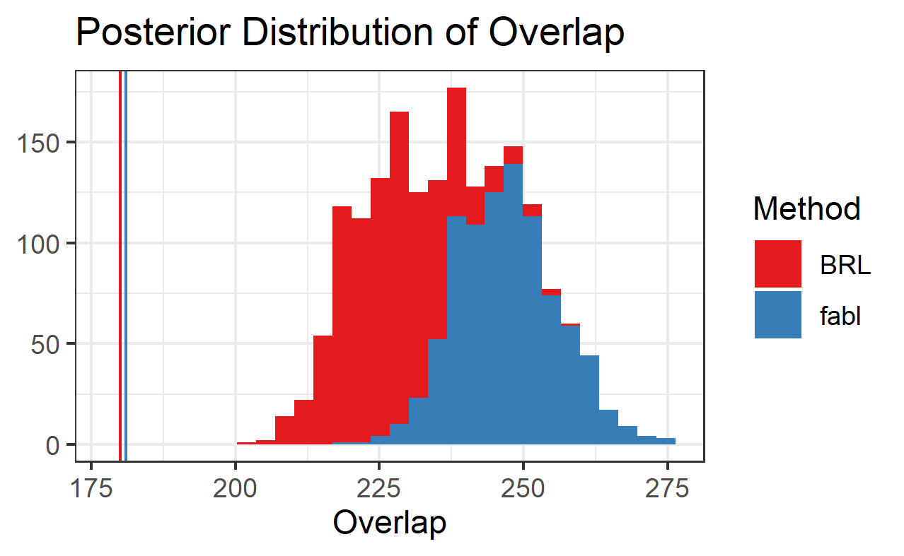

```{r setup, include=FALSE}
knitr::opts_chunk$set(echo=FALSE, out.height="80%", out.width="80%", fig.align = 'center')
library(RecordLinkage)
library(tidyverse)
```


## El Salvadoran Civil War

- El Salvadoran Civil War (1979 - 1992)

- Multiple organizations have documented casualties, and we need to find duplicates across separate datafiles to accurately estimate *documented identifiable deaths* (DID)

- Not much information, only first name, last name, and date and place of death
- Spanish language: very common for parent and child to share the same name, "second" names often omitted

## Foundations of Method

- Many record linkage methods are derived from Fellegi and Sunter's "A Theory for Record Linkage" (1969)

- Transform the $F$ fields of information among the $n_A$ records in File $A$ and the $n_B$ records in File $B$ into a $n_A n_B \times F$ matrix of comparison vectors $\Gamma$.

- Comparisons for each field $f$ are binned to integers $\{1, \ldots, L_f\}$, with 1 being the highest level of agreement

  - Common to use $\{1, 2\}$ to reflect exact agreement or disagreement, and $\{1, 2, 3\}$ to allow for partial agreement
  
## Comparison Vector Example

```{r}
knitr::include_graphics("figures/gamma_example_1.png")
```

## Comparison Vector Example

```{r}
knitr::include_graphics("figures/gamma_example_2.png")
```
<!-- ## Challenges -->

<!-- ```{r} -->
<!-- knitr::include_graphics("figures/el_salvador/rosa_records.png") -->
<!-- ``` -->

<!-- - Not much information, only first name, last name, and date and place of death -->
<!-- - Spanish language: very common for parent and child to share the same name, "second" names often omitted -->

## Previous Work

- Fellegi-Sunter (1969) made matching decisions on all $n_A n_B$ pairs independently. Fast, but can lead to severe overmatching.

- Sadinle (2017) proposed *Beta Record Linkage* (`BRL`), a Bayesian method that strictly enforces one-to-one matching. Matching proposals are *dependent*, resulting in a slow Gibbs sampler.

## Contribution

- *Fast Beta Linkage* (`fabl`, pronounced "fable") makes one proposal per record in $B$, but makes these proposals *independently*. Allows for much quicker Gibbs sampler

- Hash comparison vectors to unique patterns, perform calculations over $P$ patterns rather than $n_An_B$ record pairs

- *Storage efficient indexing* to greatly use storage requirements of comparison vectors, allowing for larger linkage tasks.

- Gibbs sampler under `fabl` has computational complexity $O(n_B \times P \times F)$, significant savings compared to `BRL`'s $O(n_B \times n_A \times F)$

## Simulation

```{r}
knitr::include_graphics("figures/sadinle_speed_plot2.png")
```

## El Salvador Data

```{r}

```


## El Salvador Data

```{r}

```


  


