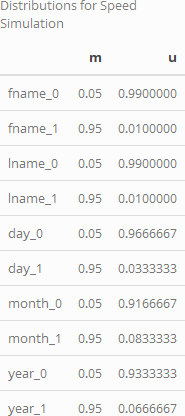
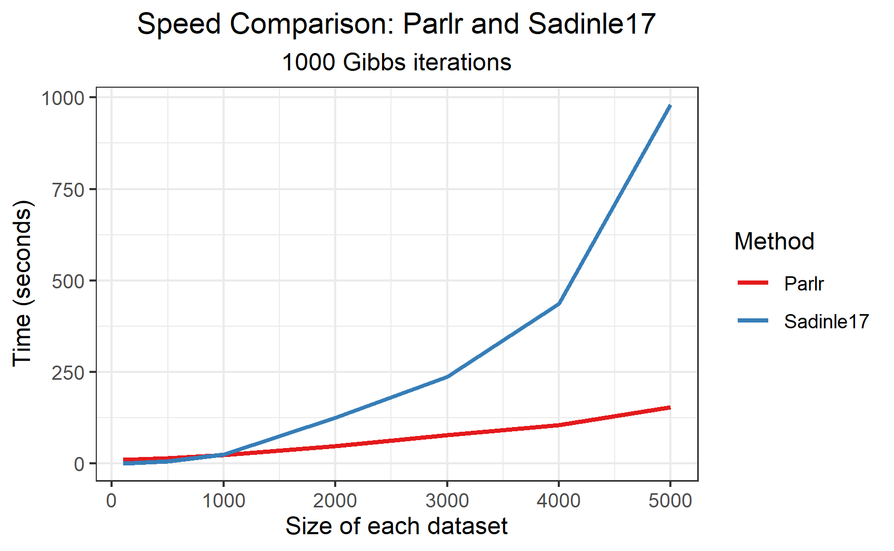

---
output:
  pdf_document:
    citation_package: natbib
    fig_caption: yes
    keep_tex: yes
    latex_engine: pdflatex
  html_document:
    df_print: paged
header-includes: \usepackage{hyperref}
linestretch: 1
link-citations: yes
linkcolor: blue
fontfamily: mathpazo
fontsize: 12pt
---
\begin{flushright} 
	\end{flushright}
	\begin{center} \textbf{Parlr: Parallelized Record Linkage in R}
	
	Brian Kundinger

	\end{center}

```{r setup, include=FALSE}
knitr::opts_chunk$set(echo = FALSE)
```

## Introduction (or Abstract?)

Record linkage is the task of identifying duplicate records across multiple data sources. This task is straightforward when provided unique identifiers or highly reliable information, but becomes difficult when data sources are plagued with error. Additionally, record linkage is inherently computationally intensive, and many existing methods are not feasible for many applications. In this paper, we propose a Bayesian model for record linkage that is amenable to parallel computing, hashing techniques and efficient storage mechanisms, that is scalable to large linkage tasks.

## Related Work

Most record linkage techniques are derived from the seminal 1969 paper by Fellegi and Sunter: "A Theory for Record Linkage". The defining characteristic of their model was to transform the sets of records, which often contain text data that is difficult to model, into sets of comparison vectors governed by parameters that can be more easily estimated. Concretely, if files $A$ and $B$ have $n_A$ and $n_B$ records respectively, and if the files share $F$ fields in common upon which to base the linkage, the Fellegi and Sunter approach generates a $n_A n_B \times F$ matrix $\Gamma$, which contains similarity scores between each pair of records across datasets. We say $\gamma_{ij}$ is the comparison vector for record $i \in A$ and record $j \in B$, with $\gamma_{ij}^f$ providing their similarity score on the $f^{th}$ field. For ease of modeling and computation, we restrict these similarity scores to be discrete, ordinal variables, and the construction of these is left to the modeler. It is common to use use binary 0-1 variables to indicate exact matching, and 0-1-2 variables to provide an option for partial matching. For text data, we calculate similarity based on Levenstein distance or some other text similarity score, and bin these scores to integers for use in the model. 

Two modern adaptations of the Fellegi Sunter model are important for understanding `parlr` and its contribution. In 2019, Enamorado et al proposed `fastlink`, a method that closely followed the modelling assumptions of Fellegi and Sunter, but used innovating hashing techniques to greatly enhance its speed and scale. Importantly, they maintained Fellegi and Sunter's independent matching assumption, in which the matching status of any $(i,j)$ pair is made independently of the matching of any other $(i', j')$. This leads to many matchings that violate "one-to-one" considerations that are often implicit in the data, which need to be resolved in a post-processing step. In contrast, Sadinle (2017) proposed "Beta Record Linkage for Bipartite Matching" and the accompanying `BRL` package which strictly enforces one-to-one matching. Specifically, in each iteration of his Gibbs sampler, he considers each record $j\in B$, removes from consideration the records $i\in A$ that have already been matched, then samples a potential link. However, accounting for these dependencies throughout the linkage process is computationally burdensome, leaving `BRL` only suitable for small to moderate linkage problems. 

Outside of the Fellegi-Sunter framework, some researchers have developed methods that model the data directly, not a derived set of comparison vectors. As an early example, Steorts et al 2016 produced `blink`, which had the advantage of a computational complexity that grew linearly with the data (as opposed to quadratically within Fellegi Sunter), but was plagued with slow mixing times and was unable to incorporate text data. Later, Steorts et al 2020 improved on this method with `dblink`, which was able to simulate text data within its Gibbs sampler by drawing from an empirical distribution, and remedied its slow mixing through a probabilistic blocking approach. However, this method remains computationally intensive and requires distributed computing to manage even moderate linkage problems in acceptable time. 

## Notation and Assumptions

Our notation and assumptions closely follow that of Sadinle (2017). Denote two files as $A$ and $B$, with $n_A$ and $n_B$ records respectively, and with records indexed as $i \in \{1, \ldots, n_A\}$ in $A$ and $j \in \{1, \ldots, n_B\}$ in $B$. Without loss of generality, label the files such that $n_A \geq n_B$. We also assume there are no duplicates within files, only across. For each record pair under consideration, we generate a comparison vector $\boldsymbol{\gamma}_{ij} = \{\gamma_{ij}^1, \ldots, \gamma_{ij}^F\}$, where  $F$ is the number of fields used in the linkage and each $\gamma_{ij}^f$ takes on a value $l \in \{1, \ldots, L_f\}$ indicating the level agreement between the two records on a specified field.

To indicate matching status, we adopt the *linkage structure parameter* $\mathbf{Z} = (Z_1, \ldots, Z_{n_B})$ from Sadinle 2017, defined as
$$Z_j=\begin{cases} 
    i,  & \text{if records } i\in A \text{ and } j\in B \text{ refer to the same entity}; \\
    n_A + 1,  & \text{if record } j\in B \text{ does not have a match in file } A; \\
\end{cases}$$
This provides more memory efficient storage for the linkage information than a $n_A \times n_B$ sparse matrix of indicators.

Following the Fellegi Sunter framework, we define $m^{fl}:= P(\gamma_{ij}^f = l |Z_j = i)$ to be the probability of observing agreement level $l$ in field $f$ for records $i$ and $j$ given that the records are a match, and similarly define $u^{fl}:= P(\gamma_{ij}^f = l |Z_j \neq i)$, for non-matches. We also adopt Fellegi and Sunter's conditionally independent fields assumption that the level of agreement on one field is independent of the level of agreement on another. Though this assumption is often not reasonable (for example, first name and gender are two clearly dependent fields), but it is common within the record linkage literature and generally leads to models that perform well in practice; see discussion for further remarks. Lastly, we define $\lambda$ to be the (marginal) probability that some record $j \in B$ has a match in $A$. 

Wherever possible, we reserve superscripts for denoting field and level, while reserving subscripts for record indices. For example, $\mathbf{m}^f = (m^{f1}, \ldots, m^{fL_f})$ is the probability distribution governing field $f$ for matching records, and $\mathbf{m}_{ij}= \prod_{f=1}^{F}\prod_{l=1}^{L_f} \left(m^{fl}\right)^{\mathbf{1}_{\gamma_{ij}^f = l}} = P(\boldsymbol{\gamma}_{ij}|Z_j = i)$ is product of the relevant of the appropriate $\mathbf{m}$ parameters for record pair $(i,j)$. We hope that these conventions avoid overloaded notation in the likelihood and subsequent derivations. 

# Model Specification

<!-- (This will be revised to talk more explicitly about sampling $Z_j$ independently) -->

<!-- Our model differs from that of Sadinle 2017 through its explicit dependence on a beta random variable $\lambda$ that models the rate of matching across records. Sadinle marginalizes over such a random variable in his derivations of  the "beta prior for bipartite matching," but here we provide derivations without marginalizing in order to specify differing rates of matching for different linkage clusters.  -->

<!-- ## Prior Distributions and Likelihood -->

For fields $f \in \{1, \ldots, F\}$ and levels $l\in \{1, \ldots, L_f\}$ we adopt the following likelihood and prior distributions. 

$$P(\Gamma|\mathbf{Z}, \mathbf{m}, \mathbf{u}, \lambda) =\prod_{j=1}^{n_B}  \prod_{i=1}^{n_A}\mathbf{m}_{ij}^{\mathbf{1}_{z_j = i}}\mathbf{u}_{ij}^{\mathbf{1}_{z_j \neq i}}$$

$$\mathbf{m^{f}} \sim \text{Dirichlet}(\alpha^{f1}, \ldots, \alpha^{fL_f})$$
$$\mathbf{u^{f}} \sim \text{Dirichlet}(\beta^{f1}, \ldots, \beta^{fL_f})$$
$$Z_j | \lambda =
\begin{cases} 
    \frac{1}{n_A}\lambda  & z_j \leq n_A; \\
     1-\lambda &  z_j  = n_A + 1 \\
\end{cases}$$

$$\lambda \sim \text{Beta}(\alpha_{\lambda}, \beta_{\lambda}) $$
The prior for $Z_j$ has equal probability of matching to all records $i\in A$, and non-matching probability governed by $\lambda$. Therefore a  $\lambda \sim \text{Beta}(1, 1)$ corresponds to a prior belief that nonmatches and matches are equally likely, and a $\lambda \sim \text{Beta}(1, \frac{1}{n_A})$ prior corresponds to a uniform prior on the labeling of $\mathbf{Z}$. 

Here the reader should the relationship between our proposed model and that of Sadinle 2017. In his model, Sadinle constructs a prior distribution on the entire $\mathbf{Z}$ vector, which induces a Gibbs sampler that strictly enforces one-to-one matching. In particular, this sampler removes previously matches records from the set of candidate records when sampling $Z_j$, creating a dependency that makes the sampler *inherently serial*. We however use independent priors for each $Z_j$, thereby weakening the one-to-one requirement; our sampler does ensure that each record in $B$ can be matched to at most one record in $A$, but allows for the possiblity that multiple records in $B$ match to the same record in $A$. With this change, components of the $\mathbf{Z}$ vector can be computed in parallel, allowing for significant computational gains.  More importantly, since only the agreement pattern of $Z_j$ is used for calculations within the Gibbs sampler, and not the particular record label, we can conduct this sampling only at the level of the unique agreement patterns, offering even more computational savings. This will be explained further in \textcolor{red}{Section XX}.


## Posterior Sampling

We work with the following factorization of the joint distribution:

$$p(\Gamma, \mathbf{Z}, \mathbf{m}, \mathbf{u}, \lambda) = p(\Gamma|\mathbf{Z}, \mathbf{m}, \mathbf{u}) p(\mathbf{Z} | \lambda) p(\mathbf{m}, \mathbf{u}) p(\lambda)$$

This factorization leads to following Gibbs Sampler:

\underline{Sample $\mathbf{m}^{(s+1)}$ $\mathbf{u}^{(s+1)}|\Gamma, \mathbf{Z}^{(s)}$:} The $\mathbf{m}$ and $\mathbf{u}$ parameters are updated through standard multinomial-dirichlet mechanics. Thus we have 

$$\mathbf{m}^f|\mathbf{Z}, \Gamma \sim \text{Dirichlet}(\alpha^{f1}(\mathbf{Z}), \ldots, \alpha^{fL_f}(\mathbf{Z}))$$
$$\mathbf{u}^f|\mathbf{Z}, \Gamma \sim \text{Dirichlet}(\beta^{f1}(\mathbf{Z}), \ldots, \beta^{fL_f}(\mathbf{Z}))$$
where $\alpha_{fl}(\mathbf{Z})= \sum_{i,j} \mathbf{1}_{obs(\gamma_{ij}^f)}\mathbf{1}_{\gamma_{ij}^f = l} \mathbf{1}_{z_j = i}$ and $\beta_{fl}(\mathbf{Z})= \mathbf{1}_{obs(\gamma_{ij}^f)}\mathbf{1}_{\gamma_{ij}^f = l} \mathbf{1}_{z_j \neq i}$.

\underline{Sample $\lambda^{(s+1)}|\mathbf{Z}^{(s)}$:} As a function of $\lambda$, the linkage structure parameter $\mathbf{Z}$ is sequence of successes (when $z_j < n_A + 1$) and failures (when $z_j = n_A + 1$), and therefore $p(\mathbf{Z}|\lambda) = \mathcal{L}(\lambda|\mathbf{Z})$ is  determined only by the number of duplicates $D = \sum_{i=1}^{n_B}\mathbf{1}_{z_j < n_A + 1}$ encoded by $\mathbf{Z}$. Thus we have

$$p(\lambda | \mathbf{Z}) \propto p(\mathbf{Z}|\lambda)p(\lambda)$$
$$\propto \lambda^D (1-\lambda)^{n_B - D} \lambda^{\alpha_{\lambda} -1} (1-\lambda)^{\beta_{\lambda} -1}$$
$$ \propto \lambda^{D + \alpha_{\lambda} - 1} (1-\lambda)^{n_B - D + \beta_{\lambda} -1}$$
$$\implies \lambda^{(s+1)}|\mathbf{Z}^{(s+1)} \sim \text{Beta}(D + \alpha_{\lambda}, n_B - D + \beta_{\lambda})$$

\underline{Sample $\mathbf{Z}^{(s+1)}|\Gamma, \mathbf{m}^{(s+1)}, \mathbf{u}^{(s+1)}, \lambda^{(s+1)}$:} Because we sample $Z_j$ independently of all other $Z_{j'}$, we use only the full conditional for an individual $Z_j$. Let $\Gamma_{.j}$ denote the set of $n_A$ comparison vectors with $j \in B$, and note that as a function of $Z_j$, the likelihood $p(\Gamma_{.j}|Z_j, \mathbf{m}, \mathbf{u}) = \mathcal{L}(Z_j|\Gamma_{.j}, \mathbf{m}, \mathbf{u})$ is a discrete distribution with probabilities proportional to 

\begin{align*}
p(\Gamma_{.j}|Z_j = z_j, \mathbf{m}, \mathbf{u}) &\propto \prod_{i=1}^{n_A}\mathbf{m}_{ij}^{\mathbf{1}_{z_j = i}}\mathbf{u}_{ij}^{\mathbf{1}_{z_j \neq i}}\\
&\propto \prod_{i=1}^{n_A}\left(\frac{\mathbf{m}_{ij}}{\mathbf{u}_{ij}}\right)^{\mathbf{1}_{z_j = i}} && \text{By dividing through by} \prod_{i = 1}^{n_A}\mathbf{u}_{ij}\\
&=
\begin{cases} 
    w_{ij}  & z_j \leq n_A; \\
    1 &  z_j  = n_A + 1 \\
\end{cases}\\
\end{align*}

where $w_{ij} = \frac{\mathbf{m}_{ij}}{\mathbf{u}_{ij}} = \frac{P(\boldsymbol{\gamma_{ij}}|Z_j = i)}{P(\boldsymbol{\gamma_{ij}} |Z_j \neq i)}$. The interested reader should note that these are precisely the likelihood ratios used in the Fellegi-Sunter model to classify matches and non-matches, and we therefore refer to $w_{ij}$ as the *Fellegi Sunter weights*.

With the likelihood in this form, we can derive the full conditional
$$p(Z_j|\Gamma_{.j}, \mathbf{m} ,\mathbf{u}, \lambda) \propto p(\Gamma_{.j}| Z_j, \mathbf{m} ,\mathbf{u}) P(Z_j|\lambda)$$

$$\propto \left(\sum_{i=1}^{n_A}w_{ij}\mathbf{1}_{z_j = i} + \mathbf{1}_{z_j = n_A + 1}\right)\left(\lambda\sum_{i=1}^{n_A}\frac{1}{n_A}\mathbf{1}_{z_j = i} + (1-\lambda)\mathbf{1}_{z_j = n_A + 1}\right)$$
$$= \frac{\lambda}{n_A}\sum_{i=1}^{n_A}w_{ij}\mathbf{1}_{z_j = i} + (1-\lambda)\mathbf{1}_{z_j = n_A + 1} $$
$$ \implies Z_j^{(s+1)} | \mathbf{m}, \mathbf{u}, \Gamma, \lambda \propto
\begin{cases} 
    \frac{\lambda}{n_A}w_{ij}   & z_j \leq n_A; \\
     1-\lambda &  z_j  = n_A + 1 \\
\end{cases}$$

In order to make fair comparisons against the Sadinle 2017 model, we integrate over the posterior of $\lambda$ and rearrange terms to produce the final full conditional:

$$p\left(Z_j^{(s+1)}  = i| \mathbf{m}, \mathbf{u}, \mathbf{Z^{(s)}}\right) \propto
\begin{cases} 
    w_{ij}  & i \leq n_A; \\
     n_A \frac{n_B - D + \beta_{\lambda}}{D + \alpha_{\lambda}} & i  = n_A + 1 \\
\end{cases}$$


## Bayes Estimate

<!-- Our Gibbs sampler provides posterior samples of $\mathbf{Z}$ which we use to make our final decisions about the linkage structure. In the case where we false matches and missed matches contribute the same loss, we declare $(i,j)$ to be a match whenever $P(Z_j = i) > \frac{1}{2}$ according to these posterior samples. We can create more elaborate decisions by attributing different loss values to different kinds of error, and allowing pairings with middling posterior probabilities to be left unlabeled by the algorithm so that the modeler can address those manually. For further discussion, see Sadinle 2017. -->

(Adapt from Sadinle)

Since our Gibbs procedure does not strictly enforce one-to-one matching, it is possible for the final Bayes estimate to link multiple records in $B$ to one record in $A$. The modeler can either report both such matches (with their respective posterior match probabilities), or resolve these conflicts by accepting only the match with highest posterior probability. Rigorous proof of this resolution procedure is deferred to future work.

# Efficient Computation

Broadly speaking, we increase our computational efficiency by recognizing that record pairs contribute to posterior calculations only through the agreement pattern of the $\gamma_{ij}$ vector. Let $\mathcal{H}$ be the set of unique agreement patterns in the data, let $P$ denote the total number of unique agreement patterns. Note that $P$ is bounded above by $\prod_{f=1}^F L_f$, and that this bound does not scale with $n_A$ or $n_B$. Prior to processing the data, we identify all $P$ patterns in $\mathcal{H}$ and enumerate them $h_1, \ldots, h_P$. When the $(i,j)$ pair exhibits the $p^{th}$ agreement pattern, we say $(i,j) \in h_p$. Wherever possible, we conduct calculations over these $P$ agreement patterns rather than the $n_A \times n_B$ record pairs.

## Data Representation, Hashing, and Storage

The classic Fellegi Sunter method represents the $\gamma_{ij}$ comparison vector as vector of length $F$, with each component $\gamma_{ij}^f$ taking on values in  $\{0, \ldots, L_f - 1\}$. To ease computations, we instead represent the comparison as a concatenation of $F$ many binary indicator vectors of lengths $L_f$. For example, if $L_1 = L_2 = 2$ and $L_3 = 3$, then $\gamma_{ij} = (1, 0, 2)$ under the classical framework becomes $\gamma_{ij} = (0, 1, 1, 0, 0, 0, 1)$ under our framework. This is a bijective transformation that does not change the meaning of the data, but this representation will ease calculations and posterior updates. 

In the classic Fellegi Sunter framework, $\Gamma$ is a $n_A n_B \times F$ matrix, with each row providing the comparison vector for a different $(i,j)$ pair. We however do not store these comparison vectors themselves, but instead only a hashed value corresponding to the agreement pattern of the $(i, j)$ pair. We store this information in a nested list $\tilde{\Gamma}$ where the $p^{th}$ component of the $j^{th}$ list contains a vector of records in $A$ that share agreement pattern $p$ with record $j \in B$. For each $p$, we also calculate $H_p = \sum_{i=1}^{n_A}\sum_{j=1}^{n_B} \mathbf{1}_{(i,j) \in h_p}$, the total instances of agreement pattern $p$ throughout the data, and also for each $j$, we  calculate $H_{p_j} = \sum_{i=1}^{n_A} \mathbf{1}_{{(i,j) \in h_p}}$ the instances of agreement pattern $p$ among the comparison vectors between record $j \in B$ and each of the $n_A$ records in $A$. 

For large data, we can partition the two datasets $A$ and $B$ into smaller blocks $\{A_m\}$ and $\{B_m\}$ for more manageable computations. On a single machine, we can read-in data sequentially, conduct hashing, collect results, and delete the original data from memory before continuing with the next chunk of data. With multiple cores or multiple machines, this can be done in parallel. Storing this hashed information still becomes burdensome for large data, but this hashing method greatly expands the capabilities of the Fellegi-Sunter framework. 

The hashing procedure described above considerably reduces the memory needed to store the comparison information: instead of storing $n_A \times n_B$ comparison vectors, which are relatively long under either the Fellegi Sunter or our modified framework, we only store the $P$ unique vectors, and then $n_A \times n_B$ scalar quantities relating record pairs to those vectors. However, even storing these $n_A \times n_B$ scalar labels can become burdensome with large data. Worse, the overwhelming majority of these labels relate to record pairs that are clear non-matches. 

To address this, we propose a new strategy called *storage efficient indexing* (SEI). In standard indexing, the modeler decides a certain criteria that they expect all true matching pairs to satisfy, and a priori label any record pairs that do not meet that criteria as non-matching. For example, one might only consider pairs with a certain similarity score on a field deemed to be important (like first name), or only pairs with exact matching on a specified number of fields. While generally chosen to be be quite loose, establishing these criteria requires knowledge of the problem and invites room for human error. We propose a method of reducing the comparison space (and reducing storage requirements) without these drawbacks. Note that all records of the same agreement pattern have the same probability when sampling $Z_j$. Therefore we know that records belonging to an $h_p$ such that $H_{p_j}$ is large are very unlikely to be sampled consistently enough to be deemed a match through the Bayes estimate, even without considering the form of the agreement pattern itself. In random indexing, rather than store all of these unlikely record labels, we choose to store only a small number $R$ of them. Posterior calculations still attribute the appropriate weight to all records through the summary statistics $H_{p_j}, H_p^m$, and $H_p^u$; this is similar to the *u-correction* concept introduced by ________. Rather than storing $n_A \times n_B$ record labels, random indexing allows us to store at most $n_B \times P \times R$, regardless of how large $n_A$ is. Coupled with the partitioning strategy for creating comparison vectors, this greatly expands the size of the linkage tasks we can undertake.


## Gibbs Sampling

\underline{Updating $\mathbf{m}$ and $\mathbf{u}$:} After receiving matching statuses from $\mathbf{Z}$, the Sadinle method calculates $\alpha_{fl}(\mathbf{Z})$ and $\beta_{fl}(\mathbf{Z})$ for each field and level. This constitutes $2 \times \sum L_f$ many summations over $n_A \times n_B$ quantities, and becomes computationally burdensome with large data. In contrast, we recognize that each unique agreement pattern contributes to the posterior $\alpha(\mathbf{Z})$ and $\beta(\mathbf{Z})$ vectors in the same way. In fact, if we denote $H_p^m = \sum_{j=1}^{n_B} \mathbf{1}_{(Z_j, j) \in h_p}$ to be the number of matching record pairs with agreement pattern $p$, then the contribution of pairs of pattern $p$ to the $\alpha(\mathbf{Z})$ vector is simply $H_p^m \times h_p$. Thus our posterior update for $\alpha$ is simply $\alpha(\mathbf{Z}) = \alpha_0 + \sum_{p=1}^P H_p^m \times h_p$. Then, we can easily calculate $H_p^u$, the number of nonmatching record pairs of agreement pattern $p$, by subtracting the number of matching pairs from the total present in the data; that is $H_p^u = H_p - H_p^m$. From this, we can update our $\beta$ parameter through  $\beta(\mathbf{Z}) = \beta_0 + \sum_{p=1}^P H_p^u \times h_p$. Note that these constitute $P$ many summations over $n_B$ quantities, and thus avoid the $n_A \times n_B$ summation from the original method. 

<!-- Sadinle uses a prior for $\mathbf{Z}$ that induces the a full conditional for $Z_j$ that strictly enforces one-to-one matching, given by  -->

<!-- $$p\left(Z_j^{(s+1)}  = i| \mathbf{m}, \mathbf{u}, \mathbf{Z^{(s)}}\right) \propto -->
<!-- \begin{cases}  -->
<!--     w_{ij} \mathbf{1}_{i \neq Z_{j'}; \; j' \neq j} & i \leq n_A; \\ -->
<!--      D_{-j} \frac{n_B - D_{-j} + \beta_{\lambda}}{D_{-j} + \alpha_{\lambda}} & i  = n_A + 1 \\ -->
<!-- \end{cases}$$ -->

<!-- The indicator removes previously matched records from the set of candidate records, and $D_{-j}:=\sum_{B \setminus j} $ updates iteratively after each matching decision, $n_B$ many times per Gibbs iteration. This process is *inherently serial* and becomes computationally burdensome for large data.  -->

<!-- Sadinle uses a prior for $\mathbf{Z}$ that induces the a full conditional for $Z_j$ that strictly enforces one-to-one matching. In particular, this sampler removes previously matches records from the set of candidate records when sampling $Z_j$, creating a dependency that makes the sampler *inherently serial*. By weakening the one-to-one requirement, our full conditional for $Z$ does not depend on the rest of the $\mathbf{Z}_{-j}$ vector, and thus can be computed in parallel. More importantly, since only the agreement pattern of $Z_j$ is used for calculations within the Gibbs sampler, and not the particular record label, we can conduct this sampling only at the level of the unique agreement patterns. This boosts computation time far greater than parallelization.  -->

\underline{Updating $\mathbf{Z}$:} Although sampling $Z_j$ from a the full conditional provided earlier is conceptually straightforward, it becomes computational burdensome when $n_A$ is larger. The reader can confirm that sampling a value from a large set of unequal probabilities becomes difficult in most programming languages. To speed up computation, we break this sampling step into two simpler steps. First, we calculate the Fellegi Sunter weight $w_{h_p}$ associated with each unique pattern and sample the agreement pattern between $j$ and its potential match. Second, we sample the record label uniformly among records associated with that agreement pattern for that particular $j\in B$. More concretely, define $h(Z_j)$ to be the agreement pattern between $j$ and its potential match, and say $h(Z_j) = h_{P+1}$ when $Z_j = n_A + 1$. Then, 

$$h\left(Z_j^{(s+1)}\right) | \mathbf{m}, \mathbf{u}, \mathbf{Z^{(s)}} \propto
\begin{cases} 
    w_{h_p}\times H_{p_j}  & p \leq P; \\
     n_A \frac{n_B - D + \beta_{\lambda}}{D + \alpha_{\lambda}} &   p = P + 1 \\
\end{cases}$$
<!-- $$p\left(Z_j^{(s+1)} = i\right) = \frac{1}{\left|H\left(Z_j^{(s+1)}\right)\right|}; \;\;i \text{ such that } (i, j) \in H\left(Z_j^{(s+1)}\right)$$ -->

Lastly, we recognize that all posterior updates are governed by the agreement patterns of the record pairs rather than the record labels themselves. Thuse We complete the entire Gibbs procedure at the level of the $P$ agreement patterns. After, we can back-fill the records corresponding to the agreement patterns by sampling uniformly at random among candidate records stored in $\tilde{\Gamma}$. Sampling uniformly is computational simple even for large sets of candidate records, but this step can also be parallelized when working with large data. 

# Simulation Studies

In his 2017 paper, Sadinle demonstrated the strength of his method by running `BRL` on simulated pairs of files with differing levels of errors and overlap. Comparing our method against `BRL` on these same simulated datasets, we find that our method only has weakened performance in the extreme scenario of very high errors and very high overlap across files. We use the following measures of accuracy in our analysis: although using only recall and precision is common in the literature, we find it useful to have a single metric the gauge overall performance, and thus also include F measure. 

$$\text{Recall} = \frac{\text{Matches Correctly Identified}}{\text{True Matches in Data}}$$
$$\text{Precision} = \frac{\text{Declared Matches}}{\text{True Matches in Data}}$$
$$\text{F-Measure} = 2\left(\frac{\text{Recall} \times \text{Precision}}{\text{Recall} + \text{Precision}}\right)$$

```{r fig.align='center'}
knitr::include_graphics("../notes/figures/sadinle_sim_plot.png")
```


To demonstrate speed, we generate comparison vectors from pre-specified distributions so that we can easily increase the size of the linkage problem. Distributions are meant to emulate the behavior of similarity scores across first name, last name, and day, month, and and year of birth, with 1 indicating an exact match on a particular field and 0 indicating a nonmatch. We simulate these data for different values of $n_A$ and $n_B$, and compare the run-time of `parlr` against `BRL`. We see that at low data size, `BRL` outperforms, but that `parlr` is significantly faster at handling larger data. 

In particular, run-time for `BRL` seems to grow quadratically while run-time for `parlr` seems to grow linearly.

\begin{table}[ht]
\centering
\begin{tabular}{rrr}
  \hline
 & m & u \\ 
  \hline
fname\_0 & 0.05 & 0.99 \\ 
  fname\_1 & 0.95 & 0.01 \\ 
  lname\_0 & 0.05 & 0.99 \\ 
  lname\_1 & 0.95 & 0.01 \\ 
  day\_0 & 0.05 & 0.97 \\ 
  day\_1 & 0.95 & 0.03 \\ 
  month\_0 & 0.05 & 0.92 \\ 
  month\_1 & 0.95 & 0.08 \\ 
  year\_0 & 0.05 & 0.93 \\ 
  year\_1 & 0.95 & 0.07 \\ 
   \hline
\end{tabular}
\end{table}


<!-- ```{r fig.align='center'} -->
<!--  -->
<!-- ``` -->

```{r fig.align='center'}

```

The above discussion suggests that for fixed $n_B$, computation time should remain mostly constant with growing $n_A$. Shockingly, this seems to be true. In the plot below, fixing $n_B = 500$, we see linear growth for the run-time under `BRL` as $n_A$ increases, with much more static run-time under `parlr`. The slight increases in run-time that we do see are due primarily to the hashing step, which again can be run in parallel for large data.

```{r fig.align='center'}
knitr::include_graphics("../notes/figures/speed_plot_fixed_nB.png")
```


We note here that `BRL` is coded in C, which makes for unfair comparison against `parlr`, currently only built in R. Additionally, although `parlr` is amenable to parallelization, this simulation was run on a single core. Running `parlr` in C++ with paralellization for the hashing step and sampling the matching status of the record pairs should lead to even more drastic results. 


# Data Analysis

- Thinking of re-running the El Salvador linkage from the Sadinle 2017 paper, but doing so with without the formal blocking and indexing that he uses. Instead, I'd use hashing and storage efficient indexing -- I should be able to do linkage on the all the data at once!

# Discussion

<!-- We note that this often not a reasonable assumption; for example if we know that two records differ on gender, this does not give any information on whether their year of births are the same, but it does suggest that its more likely that their first names are different.  -->
