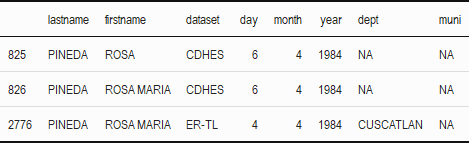

---
output:
  pdf_document:
    citation_package: natbib
    fig_caption: yes
    keep_tex: yes
    latex_engine: pdflatex
  html_document:
    df_print: paged
header-includes: \usepackage{hyperref}
linestretch: 1
link-citations: yes
linkcolor: blue
fontfamily: mathpazo
fontsize: 12pt
---
\begin{flushright} 
	\end{flushright}
	\begin{center} \textbf{Efficient and Scalable Entity Resolution with Fast Beta Linkage  (fabl)}
	
	Brian Kundinger, Rebecca Steorts, and Jerome Reiter

	\end{center}

```{r setup, include=FALSE}
knitr::opts_chunk$set(echo = FALSE, fig.align='center')
```

## Introduction 

Entity resolution (or record linkage) is the task of identifying duplicate records across multiple data sources. This task is straightforward when provided unique identifiers or highly reliable information, but becomes difficult when data sources are plagued with error. Additionally, many entity resolution tasks are large in nature, and many existing methods are too computational intensive to be used in practice. In this paper, we propose a Bayesian model for record linkage that uses hashing techniques and efficient storage mechanisms, and is amenable to parallelization, making it scalable to large linkage tasks.

The proposed method is inspired by the *Beta Record Linkage* (`BRL`) method proposed in Mauricio Sadinle's 2017 "Bayesian Estimation of Bipartite Matching for Record Linkage". To recognize this lineage, we name our method *Fast Beta Linkage* (`fabl`, pronounced "fable"). In what follows, Section 2 describes previous work in record linkage that lays the foundation for our method, Section 3 provides our model and the Gibbs sampler used for posterior inference, and Section 4 describes strategies used for more efficient and scalable implementation. Then, Section 5  demonstrates the accuracy and speed of out method through two simulation studies, and Section 6 reveals interesting properties of the method through a case study of El Salvadoran casuality records. Lastly, our discussion highlights open questions in the record linkage liturature and motivates future work. 

## Related Work

Most record linkage techniques are derived from the seminal 1969 paper by Fellegi and Sunter: "A Theory for Record Linkage". The defining characteristic of their approach was to transform the sets of records, which often contain text data that is difficult to model, into sets of comparison vectors governed by parameters that can be more easily estimated. Concretely, if files $A$ and $B$ have $n_A$ and $n_B$ records respectively, and if the files share $F$ fields in common upon which to base the linkage, the Fellegi and Sunter approach generates an $n_A n_B \times F$ matrix $\Gamma$, which contains similarity scores between each pair of records across datasets. We say $\gamma_{ij}$ is the comparison vector for record $i \in A$ and record $j \in B$, with $\gamma_{ij}^f \in \{1, \ldots, L_f\}$ providing their similarity score on the $f^{th}$ field. For ease of modeling and computation, we restrict these similarity scores to be discrete, ordinal variables, and the construction of these is left to the modeler. We adopt the convention that $\gamma_{ij}^f = 1$ corresponds to the highest level of agreement and $\gamma_{ij}^f = L_f$ corresponds to the lowest. It is common to use use binary 1-2 variables to indicate exact matching, and 1-2-3 variables to provide an option for partial matching. For text data, we calculate similarity based on Levenstein distance or some other text similarity score, and bin these scores to integers for use in the model. Jaro (1989) provided guidelines for appropriate binning for the comparison vectors, but details of implementation are generally context specific. 

The likelihood in the original Fellegi Sunter model is a mixture model through which each record pair is independently classified as a match or nonmatch. This independent classification often leads to sets of matches that break expectations of transitivity, which is undesirable. Although Jaro devised an procedure to reduce a set of conflicting matches to the mostly likely set of one-to-one matchings, the abundance of false matches can bias the estimation of other parameters of the model. 

One key strength of Sadinle's `BRL` is that it is garunteed to produce a set of bipartite matchings that respect one-to-one assumptions--without the need for any post-hoc procedures. Specifically, in each iteration of his Gibbs sampler, he considers each record $j\in B$, removes from consideration the records $i\in A$ that have already been matched, and then samples a potential link. However, accounting for these dependencies throughout the linkage process is computationally burdensome, leaving `BRL` only suitable for small to moderate linkage problems.

<!-- Two modern adaptations of the Fellegi Sunter model are important for understanding `fabl` and its contribution. In 2019, Enamorado et al proposed `fastlink`, a method that closely followed the modelling assumptions of Fellegi and Sunter, but used innovating hashing techniques to greatly enhance its speed and scale. Importantly, they maintained Fellegi and Sunter's independent matching assumption, in which the matching status of any $(i,j)$ pair is made independently of the matching of any other $(i', j')$. This leads to many matchings that violate "one-to-one" considerations that are often implicit in the data, which need to be resolved in a post-processing step. In contrast, Sadinle (2017) proposed "Beta Record Linkage for Bipartite Matching" and the accompanying `BRL` package which strictly enforces one-to-one matching. Specifically, in each iteration of his Gibbs sampler, he considers each record $j\in B$, removes from consideration the records $i\in A$ that have already been matched, then samples a potential link. However, accounting for these dependencies throughout the linkage process is computationally burdensome, leaving `BRL` only suitable for small to moderate linkage problems.  -->

Outside of the Fellegi-Sunter framework, some researchers have developed methods that model the data directly, not a derived set of comparison vectors. As an early example, Steorts et al 2016 produced `blink`, which had the advantage of a computational complexity that grew linearly with the data (as opposed to quadratically within Fellegi Sunter), but was plagued with slow mixing times and was unable to incorporate text data. Later, Steorts et al 2020 improved on this method with `dblink`, which was able to simulate text data within its Gibbs sampler by drawing from an empirical distribution, and remedied its slow mixing through a probabilistic blocking approach. However, this method remains computationally intensive and requires distributed computing to manage even moderate linkage problems in acceptable time. Because these methods fall outside of the Fellegi-Sunter framework, we do not consider them further in this paper.

## Notation and Assumptions

Denote two files as $A$ and $B$, with $n_A$ and $n_B$ records respectively, and with records indexed as $i \in \{1, \ldots, n_A\}$ in $A$ and $j \in \{1, \ldots, n_B\}$ in $B$. Without loss of generality, label the files such that $n_A \geq n_B$. We assume there are no duplicates within files, only across. For each record pair under consideration, we generate a comparison vector $\boldsymbol{\gamma}_{ij} = \{\gamma_{ij}^1, \ldots, \gamma_{ij}^F\}$, where  $F$ is the number of fields used in the linkage and each $\gamma_{ij}^f$ takes on a value $l \in \{1, \ldots, L_f\}$ indicating the level agreement between the two records on a specified field.

To indicate matching status, we adopt the *linkage structure parameter* $\mathbf{Z} = (Z_1, \ldots, Z_{n_B})$ from Sadinle 2017, defined as
$$Z_j=\begin{cases} 
    i,  & \text{if records } i\in A \text{ and } j\in B \text{ refer to the same entity}; \\
    n_A + 1,  & \text{if record } j\in B \text{ does not have a match in file } A; \\
\end{cases}$$
This provides more memory efficient storage for the linkage information than a $n_A \times n_B$ sparse matrix of indicators.

Following the Fellegi Sunter framework, we define $m^{fl}:= P(\gamma_{ij}^f = l |Z_j = i)$ to be the probability of observing agreement level $l$ in field $f$ for records $i$ and $j$ given that the records are a match, and similarly define $u^{fl}:= P(\gamma_{ij}^f = l |Z_j \neq i)$, for non-matches. We also adopt Fellegi and Sunter's conditionally independent fields assumption that the level of agreement on one field is independent of the level of agreement on another. Though this assumption is often not reasonable (for example, first name and gender are two clearly dependent fields), but it is common within the record linkage literature and generally leads to models that perform well in practice; see discussion for further remarks. Lastly, we define $\lambda$ to be the (marginal) probability that some record $j \in B$ has a match in $A$. 

Wherever possible, we reserve superscripts for denoting field and level, while reserving subscripts for record indices. For example, $\mathbf{m}^f = (m^{f1}, \ldots, m^{fL_f})$ is the probability distribution governing field $f$ for matching records, and $\mathbf{m}_{ij}= \prod_{f=1}^{F}\prod_{l=1}^{L_f} \left(m^{fl}\right)^{\mathbf{1}_{\gamma_{ij}^f = l}} = P(\boldsymbol{\gamma}_{ij}|Z_j = i)$ is product of the relevant of the appropriate $\mathbf{m}$ parameters for record pair $(i,j)$. We hope that these conventions avoid overloaded notation in the likelihood and subsequent derivations. 

## Model Specification

<!-- (This will be revised to talk more explicitly about sampling $Z_j$ independently) -->

<!-- Our model differs from that of Sadinle 2017 through its explicit dependence on a beta random variable $\lambda$ that models the rate of matching across records. Sadinle marginalizes over such a random variable in his derivations of  the "beta prior for bipartite matching," but here we provide derivations without marginalizing in order to specify differing rates of matching for different linkage clusters.  -->

<!-- ## Prior Distributions and Likelihood -->

For fields $f \in \{1, \ldots, F\}$ and levels $l\in \{1, \ldots, L_f\}$ we adopt the following likelihood and prior distributions. 

$$P(\Gamma|\mathbf{Z}, \mathbf{m}, \mathbf{u}, \lambda) =\prod_{j=1}^{n_B}  \prod_{i=1}^{n_A}\mathbf{m}_{ij}^{\mathbf{1}_{z_j = i}}\mathbf{u}_{ij}^{\mathbf{1}_{z_j \neq i}}$$

$$\mathbf{m^{f}} \sim \text{Dirichlet}(\alpha^{f1}, \ldots, \alpha^{fL_f})$$
$$\mathbf{u^{f}} \sim \text{Dirichlet}(\beta^{f1}, \ldots, \beta^{fL_f})$$
$$Z_j | \lambda =
\begin{cases} 
    \frac{1}{n_A}\lambda  & z_j \leq n_A; \\
     1-\lambda &  z_j  = n_A + 1 \\
\end{cases}$$

$$\lambda \sim \text{Beta}(\alpha_{\lambda}, \beta_{\lambda}) $$
The prior for $Z_j$ has equal probability of matching to all records $i\in A$, and non-matching probability governed by $\lambda$. Therefore a  $\lambda \sim \text{Beta}(1, 1)$ corresponds to a prior belief that nonmatches and matches are equally likely, and a $\lambda \sim \text{Beta}\left(1, \frac{1}{n_A}\right)$ prior corresponds to a uniform prior on the labeling of $\mathbf{Z}$. 

Here the reader should the relationship between our proposed model and that of Sadinle 2017. In his model, Sadinle constructs a prior distribution on the entire $\mathbf{Z}$ vector, which induces a Gibbs sampler that strictly enforces one-to-one matching. In particular, this sampler removes previously matches records from the set of candidate records when sampling $Z_j$, creating a dependency that makes the sampler *inherently serial*. We however use independent priors for each $Z_j$, creating a sampler that is *perfectly parallelizable*, allowing for significant computational gains. More importantly, since only the agreement pattern of $Z_j$ is used for calculations within the Gibbs sampler, and not the particular record label, we can conduct this sampling only at the level of the unique agreement patterns, offering even more computational savings. In doing so however, we thereby weaken the one-to-one requirement from `BRL`; our sampler does ensure that each record in $B$ can be matched to at most one record in $A$, but allows for the possiblity that multiple records in $B$ match to the same record in $A$. We explore the ramifications of this distinction with the El Salvador case study.    


## Posterior Sampling

We work with the following factorization of the joint distribution:

$$p(\Gamma, \mathbf{Z}, \mathbf{m}, \mathbf{u}, \lambda) = p(\Gamma|\mathbf{Z}, \mathbf{m}, \mathbf{u}) p(\mathbf{Z} | \lambda) p(\mathbf{m}, \mathbf{u}) p(\lambda)$$

This factorization leads to following Gibbs Sampler:

\underline{Sample $\mathbf{m}^{(s+1)}$ $\mathbf{u}^{(s+1)}|\Gamma, \mathbf{Z}^{(s)}$:} The $\mathbf{m}$ and $\mathbf{u}$ parameters are updated through standard multinomial-dirichlet mechanics. Thus we have 

$$\mathbf{m}^f|\mathbf{Z}, \Gamma \sim \text{Dirichlet}(\alpha^{f1}(\mathbf{Z}), \ldots, \alpha^{fL_f}(\mathbf{Z}))$$
$$\mathbf{u}^f|\mathbf{Z}, \Gamma \sim \text{Dirichlet}(\beta^{f1}(\mathbf{Z}), \ldots, \beta^{fL_f}(\mathbf{Z}))$$
where $\alpha_{fl}(\mathbf{Z})= \sum_{i,j} \mathbf{1}_{obs(\gamma_{ij}^f)}\mathbf{1}_{\gamma_{ij}^f = l} \mathbf{1}_{z_j = i}$ and $\beta_{fl}(\mathbf{Z})= \mathbf{1}_{obs(\gamma_{ij}^f)}\mathbf{1}_{\gamma_{ij}^f = l} \mathbf{1}_{z_j \neq i}$.

\underline{Sample $\lambda^{(s+1)}|\mathbf{Z}^{(s)}$:} As a function of $\lambda$, the linkage structure parameter $\mathbf{Z}$ is sequence of successes (when $z_j < n_A + 1$) and failures (when $z_j = n_A + 1$), and therefore $p(\mathbf{Z}|\lambda) = \mathcal{L}(\lambda|\mathbf{Z})$ is  determined only by the number of duplicates $D = \sum_{i=1}^{n_B}\mathbf{1}_{z_j < n_A + 1}$ encoded by $\mathbf{Z}$. Thus we have

$$p(\lambda | \mathbf{Z}) \propto p(\mathbf{Z}|\lambda)p(\lambda)$$
$$\propto \lambda^D (1-\lambda)^{n_B - D} \lambda^{\alpha_{\lambda} -1} (1-\lambda)^{\beta_{\lambda} -1}$$
$$ \propto \lambda^{D + \alpha_{\lambda} - 1} (1-\lambda)^{n_B - D + \beta_{\lambda} -1}$$
$$\implies \lambda^{(s+1)}|\mathbf{Z}^{(s+1)} \sim \text{Beta}(D + \alpha_{\lambda}, n_B - D + \beta_{\lambda})$$

\underline{Sample $\mathbf{Z}^{(s+1)}|\Gamma, \mathbf{m}^{(s+1)}, \mathbf{u}^{(s+1)}, \lambda^{(s+1)}$:} Because we sample $Z_j$ independently of all other $Z_{j'}$, we use only the full conditional for an individual $Z_j$. Let $\Gamma_{.j}$ denote the set of $n_A$ comparison vectors with $j \in B$, and note that as a function of $Z_j$, the likelihood $p(\Gamma_{.j}|Z_j, \mathbf{m}, \mathbf{u}) = \mathcal{L}(Z_j|\Gamma_{.j}, \mathbf{m}, \mathbf{u})$ is a discrete distribution with probabilities proportional to 

\begin{align*}
p(\Gamma_{.j}|Z_j = z_j, \mathbf{m}, \mathbf{u}) &\propto \prod_{i=1}^{n_A}\mathbf{m}_{ij}^{\mathbf{1}_{z_j = i}}\mathbf{u}_{ij}^{\mathbf{1}_{z_j \neq i}}\\
&\propto \prod_{i=1}^{n_A}\left(\frac{\mathbf{m}_{ij}}{\mathbf{u}_{ij}}\right)^{\mathbf{1}_{z_j = i}} && \text{By dividing through by} \prod_{i = 1}^{n_A}\mathbf{u}_{ij}\\
&=
\begin{cases} 
    w_{ij}  & z_j \leq n_A; \\
    1 &  z_j  = n_A + 1 \\
\end{cases}\\
\end{align*}

where $w_{ij} = \frac{\mathbf{m}_{ij}}{\mathbf{u}_{ij}} = \frac{P(\boldsymbol{\gamma_{ij}}|Z_j = i)}{P(\boldsymbol{\gamma_{ij}} |Z_j \neq i)}$. The interested reader should note that these are precisely the likelihood ratios used in the Fellegi-Sunter model to classify matches and non-matches, and we therefore refer to $w_{ij}$ as the *Fellegi Sunter weights*.

With the likelihood in this form, we can derive the full conditional
$$p(Z_j|\Gamma_{.j}, \mathbf{m} ,\mathbf{u}, \lambda) \propto p(\Gamma_{.j}| Z_j, \mathbf{m} ,\mathbf{u}) P(Z_j|\lambda)$$

$$\propto \left(\sum_{i=1}^{n_A}w_{ij}\mathbf{1}_{z_j = i} + \mathbf{1}_{z_j = n_A + 1}\right)\left(\lambda\sum_{i=1}^{n_A}\frac{1}{n_A}\mathbf{1}_{z_j = i} + (1-\lambda)\mathbf{1}_{z_j = n_A + 1}\right)$$
$$= \frac{\lambda}{n_A}\sum_{i=1}^{n_A}w_{ij}\mathbf{1}_{z_j = i} + (1-\lambda)\mathbf{1}_{z_j = n_A + 1} $$
$$ \implies Z_j^{(s+1)} | \mathbf{m}, \mathbf{u}, \Gamma, \lambda \propto
\begin{cases} 
    \frac{\lambda}{n_A}w_{ij}   & z_j \leq n_A; \\
     1-\lambda &  z_j  = n_A + 1 \\
\end{cases}$$

In order to make fair comparisons against the Sadinle 2017 model, we integrate over the posterior of $\lambda$ and rearrange terms to produce the final full conditional:

$$p\left(Z_j^{(s+1)}  = i| \mathbf{m}, \mathbf{u}, \mathbf{Z^{(s)}}\right) \propto
\begin{cases} 
    w_{ij}  & i \leq n_A; \\
     n_A \frac{n_B - D + \beta_{\lambda}}{D + \alpha_{\lambda}} & i  = n_A + 1 \\
\end{cases}$$


## Bayes Estimate

We calculate a Bayes estimate $\hat{\mathbf{Z}}$ for the linkage parameter $\mathbf{Z}$ by assigning different positive losses to different types of errors, and minimizing posterior expected loss. We adopt the loss function proposed in Sadinle 2017, in which $\hat{Z}_j \in \{1, \ldots, n_A + 1, R\}$, with $R$ representing the option to leave the matching undetermined by the model. Specifically, we minimize the quantity $L(\hat{\mathbf{Z}}, \mathbf{Z}) = \sum_{j=1}^{n_B} L(\hat{Z_j}, Z_j)$ where

$$L(\hat{Z_j}, Z_j)=\begin{cases} 
    0  & \text{if } Z_j = \hat{Z_j}; \\
    \theta_R,  & \text{if } \hat{Z_j} = R; \\
    \theta_{10},  & \text{if } Z_j \leq n_A,\hat{Z_j} = n_A + 1 ; \\
    \theta_{01},  & \text{if } Z_j = n_A + 1,\hat{Z_j} \leq n_A ; \\
    \theta_{11},  & \text{if } Z_j, \hat{Z}_j \leq n_A, Z_j \neq \hat{Z_j} ; \\
\end{cases}$$
Here, $\theta_R$ is the loss from not making a decision on the linkage status, $\theta_{10}$ is the loss from a false non-match, $\theta_{01}$ is the loss from a false match, and $\theta_{11}$ is the loss from the special case of a false match in which the record has a true match other than the one estimated by the model. This loss function leads to closed form decision rules for minimizing posterior expected loss. In this paper, we adopt losses $\theta_R = \infty, \theta_{10} = 1, \theta_{01} = 1, \theta_{11} = 2$, inducing the intuitive decision rule

$$\hat{Z}_j =\begin{cases} 
    i,  & \text{if } P(Z_j = i |\Gamma) > \frac{1}{2}; \\
    0,  & \text{otherwise} ; \\
\end{cases}$$

For a more indepth explanation of this function and the induced Bayes estimate, see Sadinle 2017. 

Since our Gibbs procedure does not strictly enforce one-to-one matching, it is possible for the final Bayes estimate to link multiple records in $B$ to one record in $A$. The modeler can either report both such matches (with their respective posterior match probabilities), or resolve these conflicts by accepting only the match with highest posterior probability. Such a resolution procedure indeed is equivalent to minimizing posterior risk under the restriction of one-to-one matching, and as thus theoretically justified within the Bayesian framework. 

# Efficient Computation

Broadly speaking, we increase our computational efficiency by recognizing that record pairs contribute to posterior calculations only through the agreement pattern of the $\gamma_{ij}$ vector. Let $\mathcal{H}$ be the set of unique agreement patterns in the data, let $P = |\mathcal{H}|$ denote the total number of unique agreement patterns. Note that $P$ is bounded above by $\prod_{f=1}^F L_f$, and that this bound does not scale with $n_A$ or $n_B$. Prior to processing the data, we identify all $P$ patterns in $\mathcal{H}$ and enumerate them $h_1, \ldots, h_P$. When the $(i,j)$ pair exhibits the $p^{th}$ agreement pattern, we say $(i,j) \in h_p$. Wherever possible, we conduct calculations over these $P$ agreement patterns rather than the $n_A \times n_B$ record pairs.

## Data Representation, Hashing, and Storage

The classic Fellegi Sunter method represents the $\gamma_{ij}$ comparison vector as vector of length $F$, with each component $\gamma_{ij}^f$ taking on values in  $\{1, \ldots, L_f \}$. To ease computations, we instead represent the comparison as a concatenation of $F$ many binary indicator vectors of lengths $L_f$. For example, if $L_1 = L_2 = 2$ and $L_3 = 3$, then $\gamma_{ij} = (2, 1, 3)$ under the classical framework becomes $\gamma_{ij} = (0, 1, 1, 0, 0, 0, 1)$ under our framework. This is a bijective transformation that does not change the meaning of the data, but this representation will ease calculations and posterior updates. 

In the classic Fellegi Sunter framework, $\Gamma$ is a $n_A n_B \times F$ matrix, with each row providing the comparison vector for a different $(i,j)$ pair. In contrast, we do not store these comparison vectors themselves, but instead only a hashed value corresponding to the agreement pattern of the $(i, j)$ pair. We store this information in a nested list $\tilde{\Gamma}$ where the $p^{th}$ component of the $j^{th}$ list contains a vector of records in $A$ that share agreement pattern $p$ with record $j \in B$. For each $p$, we also calculate $H_p = \sum_{i=1}^{n_A}\sum_{j=1}^{n_B} \mathbf{1}_{(i,j) \in h_p}$, the total instances of agreement pattern $p$ throughout the data, and also for each $j$, we  calculate $H_{p_j} = \sum_{i=1}^{n_A} \mathbf{1}_{{(i,j) \in h_p}}$ the instances of agreement pattern $p$ among the comparison vectors between record $j \in B$ and each of the $n_A$ records in $A$. 

The hashing procedure described above considerably reduces the memory needed to store the comparison information: instead of storing $n_A \times n_B$ comparison vectors, which are relatively long under either the Fellegi Sunter or our modified framework, we only store the $P$ unique vectors, and then $n_A \times n_B$ scalar quantities relating record pairs to those vectors. However, even storing these $n_A \times n_B$ scalar labels can become burdensome with large data. Worse, the overwhelming majority of these labels relate to record pairs that are clear non-matches. 

To address this, we propose a new strategy called *storage efficient indexing* (SEI). In standard indexing, the modeler decides a certain criteria that they expect all true matching pairs to satisfy, and a priori label any record pairs that do not meet that criteria as non-matching. For example, one might only consider pairs with a certain similarity score on a field deemed to be important (like first name), or only pairs with exact matching on a specified number of fields. While generally chosen to be be quite loose, establishing these criteria requires knowledge of the problem and invites room for human error. We propose a method of reducing the comparison space (and reducing storage requirements) without these drawbacks. Note that all records of the same agreement pattern have the same probability when sampling $Z_j$. Therefore we know that records belonging to an $h_p$ such that $H_{p_j}$ is large are very unlikely to be sampled consistently enough to be deemed a match through the Bayes estimate, even without considering the form of the agreement pattern itself. 

In SEI, rather than store all of these unlikely record labels, we choose to store only a small number $R$ of them. Posterior calculations still attribute the appropriate weight to all records through the summary statistics $H_p$, and $H_{p_j}$. Rather than storing $n_A \times n_B$ record labels, SEI allows us to store at most $n_B \times P \times R$ labels, regardless of how large $n_A$ is. 

Laslty, for large data, we can partition the two datasets $A$ and $B$ into smaller blocks $\{A_m\}$ and $\{B_m\}$ for more manageable computations. On a single machine, we can read-in data sequentially, conduct hashing, compress information through SEI, and delete the original data from memory before continuing with the next chunk of data. With multiple cores or multiple machines, this can be done in parallel. Thus the combination of hashing, SEI, and partitioning allows us to conduct linkage tasks over much larger datasets. 


## Gibbs Sampling

\underline{Updating $\mathbf{m}$ and $\mathbf{u}$:} After receiving matching statuses from $\mathbf{Z}$, the Sadinle method calculates $\alpha_{fl}(\mathbf{Z})$ and $\beta_{fl}(\mathbf{Z})$ for each field and level. This constitutes $2 \times \sum L_f$ many summations over $n_A \times n_B$ quantities, and becomes computationally burdensome with large data. In contrast, we recognize that each unique agreement pattern contributes to the posterior $\alpha(\mathbf{Z})$ and $\beta(\mathbf{Z})$ vectors in the same way. In fact, if we denote $H_p^m = \sum_{j=1}^{n_B} \mathbf{1}_{(Z_j, j) \in h_p}$ to be the number of matching record pairs with agreement pattern $p$, then the contribution of pairs of pattern $p$ to the $\alpha(\mathbf{Z})$ vector is simply $H_p^m \times h_p$. Thus our posterior update for $\alpha$ is simply $\alpha(\mathbf{Z}) = \alpha_0 + \sum_{p=1}^P H_p^m \times h_p$. Then, we can easily calculate $H_p^u$, the number of nonmatching record pairs of agreement pattern $p$, by subtracting the number of matching pairs from the total present in the data; that is $H_p^u = H_p - H_p^m$. From this, we can update our $\beta$ parameter through  $\beta(\mathbf{Z}) = \beta_0 + \sum_{p=1}^P H_p^u \times h_p$. Note that these constitute $P$ many summations over $n_B$ quantities, and thus avoid the $n_A \times n_B$ summation from the original method. 

\underline{Updating $\mathbf{Z}$:} Although sampling $Z_j$ from a the full conditional provided earlier is conceptually straightforward, it becomes computational burdensome when $n_A$ is larger. The reader can confirm that sampling a value from a large set of unequal probabilities becomes difficult in most programming languages. To speed up computation, we break this sampling step into two simpler steps. First, we calculate the Fellegi Sunter weight $w_{p}$ associated with each unique pattern and sample the agreement pattern between $j$ and its potential match. Second, we sample the record label uniformly among records associated with that agreement pattern for that particular $j\in B$. More concretely, define $h(Z_j)$ to be the agreement pattern between $j$ and its potential match, and say $h(Z_j) = h_{P+1}$ when $Z_j = n_A + 1$. Then, 

$$P\left(h\left(Z_j^{(s+1)}\right) = p | \mathbf{m}, \mathbf{u}, \mathbf{Z^{(s)}}\right) \propto
\begin{cases} 
    w_{p}\times H_{p_j}  & p \leq P; \\
     n_A \frac{n_B - D + \beta_{\lambda}}{D + \alpha_{\lambda}} &   p = P + 1 \\
\end{cases}$$
$$P\left(Z_j^{(s+1)} = i\bigg|\;\; h\left(Z_j^{(s+1)}\right) = p\right) = \begin{cases} 
\frac{1}{H_{p_j}} & (i, j) \in h_p \\
0 & \text{otherwise} \\
\end{cases}$$

Lastly, we recognize that all posterior updates are governed by the agreement patterns of the record pairs rather than the record labels themselves. Thus we complete the entire Gibbs procedure first at the level of the $P$ agreement patterns with the first equation above. After, we can back-fill the records corresponding to the agreement patterns through the second equation. Sampling uniformly is computational simple even for large sets of candidate records, but this step can also be parallelized when working with large data. 

# Simulation Study 1 - Accuracy

In his 2017 paper, Sadinle demonstrated the accuracy of his method by running `BRL` on simulated pairs of files with differing levels of errors and overlap. Each file consists of first name, last name, gender, postal code, age, and occupation, and following Sadinle's implementation, we use only four fields for the linkage process: both names, age, and occupation. Similarity scores for the names are binned into three levels according the default settings for the `compareRecords` function in the `BRL` package, and age and occupation similarity scores are binary for exact matching. We use flat priors for all $\mathbf{m}$ and $\mathbf{u}$ parameters, and run the Gibbs sampler for 1000 iterations, with the first 100 discarded as burn-in. 

Comparing our method against `BRL` on these same simulated datasets, we find that our method only has weakened performance in the most extreme scenario of very high errors and very high overlap across files. We use the following measures of accuracy in our analysis: although using only recall and precision is common in the literature, we find it useful to have a single metric to gauge overall performance, and thus also include F measure.

$$\text{Recall} = \frac{\text{Matches Correctly Identified}}{\text{True Matches in Data}}$$
$$\text{Precision} = \frac{\text{Declared Matches}}{\text{True Matches in Data}}$$
$$\text{F-Measure} = 2\left(\frac{\text{Recall} \times \text{Precision}}{\text{Recall} + \text{Precision}}\right)$$

```{r fig.cap="Posterior means and credible intervals for accuracy metrics under the replication of simulation study from Sadinle 2017. For each level of overlap and each level of error, we have 100 paired sets of 500 records."}
knitr::include_graphics("../notes/figures/sadinle_sim_plot.png")
```

# Simulation Study 2 - Speed

To demonstrate speed, we generate comparison vectors from pre-specified distributions so that we can easily increase the size of the linkage problem. Distributions are meant to emulate the behavior of similarity scores across first name, last name, and day, month. For simplicity, we consider only exact matching, so a vector (1, 0) corresponds to agreeement and (0, 1) to disagreement.  We simulate these data for different values of $n_A$ and $n_B$, and compare the run-time of `fabl` against `BRL`. Note that the number of unique patterns $P$ is bounded above by $2^5 = 32$, a bound which is consistently attained in the larger simulations. 

We see that at low data size, `BRL` outperforms, but that `fabl` is significantly faster at handling larger data. In particular, run-time for `BRL` seems to grow quadratically (or linearly with the size of both $A$ and $B$) while run-time for `fabl` seems to grow linearly (in the size of $B$).

\begin{table}[ht]
\centering
\begin{tabular}{rrr}
  \hline
 & m & u \\ 
  \hline
  fname & (0.95, 0.05) & (0.01, 0.99) \\ 
  lname & (0.95, 0.05) & (0.01, 0.99) \\ 
  day & (0.95, 0.05) & (0.03, 0.97) \\ 
  month & (0.95, 0.05) & (0.08, 0.92) \\ 
  year & (0.95, 0.05) & (0.07, 0.93) \\ 
   \hline
\end{tabular}
\end{table}


```{r fig.cap="Runtime for BRL and fabl to run 1000 Gibbs iterations, including hashing step for fabl, for increasing values of both $n_A$ and $n_B$"}
knitr::include_graphics("../notes/figures/sadinle_speed_plot2.png")
```

The above discussion suggests that for fixed $n_B$, computation time should remain mostly constant with growing $n_A$. Simulation study suggests that this is true. In the plot below, fixing $n_B = 500$, we see linear growth for the run-time under `BRL` as $n_A$ increases, with much more static run-time under `fabl`. The slight increases in run-time that we do see are due primarily to the hashing step, which again can be run in parallel for large data.

```{r fig.cap="Runtime for BRL and fabl to run 1000 Gibbs iterations, including hashing step for fabl, with increasing $n_A$, and $n_B$ fixed at 500"}
knitr::include_graphics("../notes/figures/speed_plot_fixed_nB.png")
```


We note here that `BRL` is coded in C, which makes for unfair comparison against `fabl`, currently only built in R. Additionally, although `fabl` is amenable to parallelization, this simulation was run on a single core. Running `fabl` in C++ with paralellization for the hashing step and sampling the matching status of the record pairs should lead to even more computational gains. 


# Data Analysis

The country of El Salvador was immersed in civil war from 1980 to 1991, and throughout the time, several organizations attempted to document casualties of the conflict. When estimating the total number of casualities, one cannot simply sum the numbers recorded by each organization, as it is likely that the same individuals are recorded in multiple casuality lists. To obtain a more accurate estimate of the casualties then, we follow Sadinle's 2017 paper and link records of El Salvadoran civilian casualties from two sources: El Rescate - Tutela Regal (ERTL) and the Salvadoran Human Rights Commission (CDHES, by its acronym in Spanish). The ERTL dataset consists of digitized reports that had been published throughout the conflict. The CDHES dataset consists of casualties that had been reported directly to the organization, and later digitized. 

There are several challenges with working with such data. Firstly, both datasets have been automatically digitized, which inherently leads to some degree of typographical error. Secondly, the CDHES records are all second hand accounts reported by individuals, which can result in additional errors. Lastly, the only fields recorded are given name, last name, date of death, and place of death; it is relatively common for a parent and child to share the same given name, resulting in indistinguishable records for two different individuals. This last point nearly breaks the earlier mentioned assumption that there are no duplicates within files, and reveals a key difference between `BRL` and our proposed method. 

We only utilized records with nonmissing entries for given and last name, results in $n_A = 4420$ files in CHDES and $n_B = 1323$ files in ERTL. The names were standardized to account for common misspellings in the Spanish language, and then compared using a modified Levenstein distance to account for the fact that second names are often ommited. Place of birth is recorded by municipality and department within that municipality; however, since  department was missing in 95% of records in CHDES and 80% of records in ERTL, we excluded it from our linkage process. Thus we conduct linkage using given name, last name, municipality, and day, month, and year of death. We again use flat priors for the $\mathbf{m}$ and $\mathbf{u}$ parameters.

```{r fig.cap="Posterior estimates of m parameters with 95\\% credible intervals"}
knitr::include_graphics("../notes/figures/el_salvador/m_posterior_smallP.png")
```


To mirror the original implementation, we constructed the comparison vectors using 4 levels of agreement for each field, according to the thresholds provided in Figure XX. This took 422 seconds for our proposed method and 240 for `BRL`.  However, we observed that posterior distributions of several levels of the $\mathbf{m}$ and $\mathbf{u}$ parameters were nearly identical, and that of the $4^5 \times 2 = 2048$ possible agreement patterns, only 1173 are realized in the data. This leads us to believe that such high number of aggreement levels creates unnecesary distictions in the data and makes the comparison vectors less interpretable. Therefore we re-ran our analysis with fewer agreement levels for each field (see Figure XX), and obtained analogous results. With 216 possible agreement patterns, 159 were realized in the data, and our proposed method became much faster, finishing in 124 seconds. Meanwhile `BRL` took 239 seconds, relatively unchanged from the first implementation. This demonstrates the way that the computational complexity of our method depends on the number of unique agreement patterns, and how significant computional gains can be made by simplifying the construction of the comparison vectors. We also note that estimates of the $\mathbf{m}$ and $\mathbf{u}$ paramters under each method are very similar, as shown in Figure XX. 

## Violations of One-to-One Matching

Figure XX shows the posterior distribution for $D$, the number of duplicates found across file for both `fabl` and `BRL`. We see that `fabl` consistently overmatches within each Gibbs iteration when compared to `BRL`, which is to be expected because `BRL` explicitly prevents matches that violate one-to-one matching throughout the entire sampler. Most of such matchings are due to the randomness in the sampling procedure, and they occur sporadically throughout the sampler in such a way that does not measurably influence the eventual Bayes estimate. 


```{r fig.cap="Posterior distribution of overlap across the two files. The solid lines show the Bayes estimate for the amonut of overlap, and the dashed line is the Bayes estimate under fabl before resolving violations of one-to-one matching"}

```

Overall, both methods presented similar results. `fabl` yielded an initial Bayes estimate of 195 matches found across files, and after resolving matches that violated one-to-one requirements, yeilded 180 matches across files. This is acceptably close to the 181 matches found by `BRL`. The main reason for this discrepancy is the difference in how each model handles situations in which one file in $B$ has multiple plausible matches in $A$. 

```{r fig.cap="Example of linkage situation with multiple plausible matches"}

```


```{r fig.cap="Gibbs sampling in situation with multiple plausible matches."}
knitr::include_graphics("../notes/figures/el_salvador/bad_mixing.png")
```

The records shown in Figure XX provide one such instance. Note these records present a near violation of our assumption that there are no duplications within files; we continue to assume that records 825 and 826 in ERTL correspond to different individuals, but their records are nearly identical. Additionally, using the modified Levenstein distance from Sadinle 2017, the comparison vectors $\gamma_{2776, 825}$ and $\gamma_{2776, 826}$ are exactly identical. 

Figure XX shows the values that $Z_{825}$ and $Z_{826}$ take on throughout the Gibbs sampler, and demonstrates how each method handles this situation. Under `fabl`, both records in $B$ match to the same record in $A$ throughout the Gibbs process, creating consistent violations of one-to-one matching. Under `BRL`, the Gibbs process creates one matching configuration stays there for a while. However, if one pair "unmatches," then the other record has a chance to latch on. Then, the Gibbs process is stuck with that matching status for a while, resulting in a Gibbs process with poor mixing. Additionally, `fabl` allows the modeller to inspect records with mulitple plausible matches, and if they desire, to then choose the record pairing with the highest posterior probability. `BRL` in contrast, in strictly enforcing one-to-one matching throughout the sampler, can lead to situations where none of the plausible matches reach the threshold to be identified through the Bayes estimate.

# Discussion

We have presented a method for Bayesian record linkage that is feasible for large datasets. In particular, our hashing procedure and model assumptions allow for a linkage procedure whose computational complexity does not scale with the size of the larger dataset, making this method particularly powerful in linking records when one datafile is substantially smaller than the other.

In our case study, we included an exploration of how to conduct record linkage when modelling assumptions are not met in practice. We explored "one-to-many" scenarios in which one record in $A$ has multiple plausible matches in $B$, and showed how both `fabl` and `BRL` demonstrated undesirable qualities. Other issues arise under "many-to-one" scenarios, where one record in $B$ has multiple plausible matches in $A$, and "many-to-many" scenarios in which there is duplication both across and within datasets. Tuning `fabl` for use in these scenarious is one potential avenue for future work.


